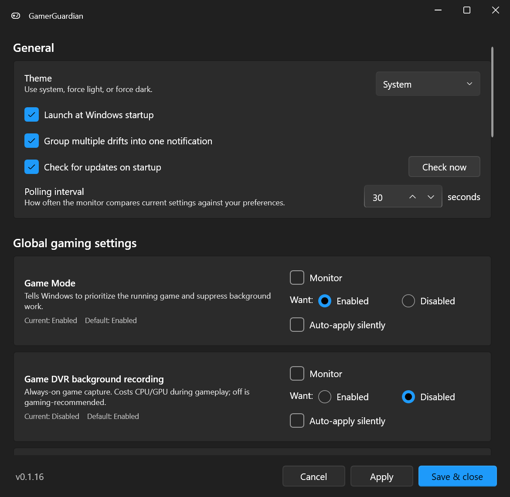

# GamerGuardian

A lightweight Windows 11 tray app that watches gaming-related display and system settings, alerts you (or auto-fixes) when they drift from your preferences, and stays out of the way during gameplay and benchmarks.

[Install](https://github.com/carterscode/GamerGuardian/wiki/Installation) · [Build](https://github.com/carterscode/GamerGuardian/wiki/Build-from-source) · [Verification](https://github.com/carterscode/GamerGuardian/wiki/Verification) · [Logging](https://github.com/carterscode/GamerGuardian/wiki/Logging) · [Security](https://github.com/carterscode/GamerGuardian/wiki/Security)

---

## Why this exists

If you've ever fired up a game and realized 30 minutes later that HDR turned itself off after the last driver update, or that you've been gaming at 60 Hz instead of your monitor's actual max — GamerGuardian is for that. It periodically compares Windows settings against your preferences and either prompts you to fix drift in one click, or silently corrects it in the background.

It's also paranoid about not making your gaming worse. Polling pauses entirely during fullscreen games (including borderless windowed) and benchmark runs. Working set is trimmed back to ~25 MB at idle. No process spawning, no kernel hooks, no DPC callbacks.

## Highlights

- 🎯 **17+ monitored settings** spanning display, security, performance, capture, input, and Windows services
- 🎮 **Pauses during gameplay** — fullscreen, borderless, *and* during benchmark runs (3DMark, Cinebench, Geekbench, etc.)
- ⚡ **One-click apply** with a per-setting auto-apply opt-in
- 🪟 **Native Win11 Fluent design** with light / dark / system themes
- 🔄 **Auto-update** — checks GitHub Releases on startup, one-click install
- 🪶 **~23 MB idle working set**, ~10 ms per polling tick

## Screenshot

*Settings window — General, Global gaming, Windows services, and Display tabs. Each card shows a description, current state, Windows default, and per-setting Monitor / Want / Auto-apply controls.*

## What it watches

For each setting you choose: **monitor or not**, **desired value**, and whether to **auto-apply silently** when it drifts.

### Per-display

| Setting | Notes |
|---|---|
| [**HDR**](https://support.microsoft.com/en-us/windows/hdr-settings-in-windows-2d767185-38ec-7fdc-6f97-bbc6c5ef24e6) | On/off via Windows Display Configuration (CCD) API |
| [**Refresh rate**](https://support.microsoft.com/en-us/windows/change-the-refresh-rate-on-your-monitor-in-windows-c8ea729e-0678-015c-c415-f806f04aae5a) | Maximum supported, or pin a specific Hz |
| [**Resolution**](https://support.microsoft.com/en-us/windows/change-your-screen-resolution-and-layout-in-windows-5effefe3-2eac-e306-0b5d-2073b765876b) | Pin to a specific resolution (opt-in) |

### Global gaming settings

| Setting | What it does | Reboot |
|---|---|:---:|
| [**HAGS**](https://devblogs.microsoft.com/directx/hardware-accelerated-gpu-scheduling/) | Lets the GPU manage its own command queue. Lower latency on supported GPUs. | ✓ |
| [**Memory Integrity / VBS**](https://support.microsoft.com/en-us/windows/core-isolation-e30ed737-17d8-42f3-a2a9-87521df09b78) | HVCI. Disabling recovers ~5–15% gaming perf at the cost of reduced malware protection. | ✓ |
| [**Game Mode**](https://support.xbox.com/en-US/help/games-apps/game-setup-and-play/use-game-mode-gaming-on-pc) | Tells Windows to prioritize the running game and suppress background work. | |
| [**Game DVR background recording**](https://support.xbox.com/help/games-apps/game-dvr/game-dvr-windows-10) | Always-on game capture. Costs CPU/GPU during gameplay. | |
| [**Mouse "Enhance pointer precision"**](https://support.microsoft.com/en-us/windows/change-mouse-settings-e81356a4-0e74-fe38-7d01-9d79fbf8712b) | Acceleration curve applied to mouse movement. | |
| [**Fullscreen optimizations**](https://devblogs.microsoft.com/directx/demystifying-full-screen-optimizations/) | Borderless-windowed compositing layer for fullscreen apps. | |
| [**Variable Refresh Rate (DirectX)**](https://devblogs.microsoft.com/directx/os-variable-refresh-rate/) | G-Sync / FreeSync compatibility flag. Not the same as Dynamic Refresh Rate (DRR). | |
| [**Power plan**](https://learn.microsoft.com/en-us/windows-hardware/customize/power-settings/configure-power-settings) | Active Windows power scheme. | |
| [**System Responsiveness**](https://learn.microsoft.com/en-us/windows/win32/procthread/multimedia-class-scheduler-service) | MMCSS reservation percentage. | ✓ |
| [**Network Throttling**](https://learn.microsoft.com/en-us/windows/win32/procthread/multimedia-class-scheduler-service) | MMCSS network packet pacing. | |
| [**USB Selective Suspend**](https://learn.microsoft.com/en-us/windows-hardware/drivers/usbcon/usb-selective-suspend) | Lets Windows suspend idle USB devices. | ✓ |
| [**Games multimedia task profile**](https://learn.microsoft.com/en-us/windows/win32/procthread/multimedia-class-scheduler-service) | Priority + scheduling values for the MMCSS Games task. | |

### Windows services

A curated catalog of services GamerGuardian can stop + disable (or set to Manual). One-click "Gaming optimized" preset, plus per-service Default/Manual/Disabled. Includes `DiagTrack` (telemetry), `MapsBroker`, `Fax`, `lfsvc` (Geolocation), Xbox services, `DoSvc` (Delivery Optimization), `iphlpsvc` (IP Helper), and more. See [`ServiceCatalog.cs`](src/GamerGuardian/Services/ServiceCatalog.cs) for the full list.

## Performance & gaming impact

Designed to be invisible during gameplay.

- **~23 MB working set** at idle, **~10 ms** per polling tick (default 30 s interval).
- **Pauses entirely** during fullscreen games, borderless-fullscreen games, and known benchmarks (3DMark, Cinebench, Geekbench, AIDA64, Unigine, OCCT, etc.).
- **No process spawning** for reads. Power plan reads/writes go through `powrprof.dll` directly.
- **No kernel hooks, no drivers, no admin** — only HKLM writes need elevation, which prompts UAC.

Memory + pause-detection details: [Build from source](https://github.com/carterscode/GamerGuardian/wiki/Build-from-source) (CI build flags) and [`MonitorService.cs`](src/GamerGuardian/Services/MonitorService.cs).

## How it works

Pure user-mode P/Invoke. Each monitored setting is an `IMonitoredSetting` implementation in [`src/GamerGuardian/Monitors/`](src/GamerGuardian/Monitors/) — adding a new one is ~30 lines. Full source-file reference: [Source file reference](https://github.com/carterscode/GamerGuardian/wiki/Source-file-reference).

| API surface | Used for |
|---|---|
| Connecting and Configuring Displays (CCD) | HDR state, VRR, display enumeration |
| `EnumDisplaySettingsEx` / `ChangeDisplaySettingsEx` | Refresh rate, resolution |
| `powrprof.dll` | Power plan |
| `SystemParametersInfo` | Mouse precision |
| Direct `HKCU` / `HKLM` registry access | All registry-backed settings |
| `sc.exe` (via `Verb=runas`) | Windows service start type + stop |
| `SHQueryUserNotificationState` | Fullscreen game / presentation detection |
| `Process.GetProcesses` | Benchmark detection |
| `EmptyWorkingSet` (psapi) | Working-set trimming |

## Verification

GamerGuardian doesn't ask you to take its word for it. Six independent ways to confirm what it's doing — see [Verification](https://github.com/carterscode/GamerGuardian/wiki/Verification) for the full rundown:

1. The Settings UI re-reads from the OS after every Apply
2. The Apply Results window shows before / target / after for each setting
3. Every change writes a copy-pasteable PowerShell verify command to [`changes.log`](https://github.com/carterscode/GamerGuardian/wiki/Logging)
4. `GamerGuardian.exe --test` dumps every monitor's current readout to `%TEMP%`
5. Every Release ships with a [`SHA256SUMS.txt`](https://github.com/carterscode/GamerGuardian/wiki/Security#reproducibility) you can verify against your local download
6. Every monitor is one ~30-line file in [`src/GamerGuardian/Monitors/`](src/GamerGuardian/Monitors/)

## Security

CodeQL static analysis, Dependabot vulnerability watch, OpenSSF Scorecard public score, and SHA-256 checksums on every Release. Code signing via SignPath OSS is on the roadmap. Full details + spot-check guide: [Security](https://github.com/carterscode/GamerGuardian/wiki/Security).

Reporting a vulnerability: [SECURITY.md](SECURITY.md).

## Compatibility

- **Windows 11** (any version). Windows 10 support is on the roadmap.
- **x64** only.

## Contributing

Issues and PRs welcome. New monitor modules just need to implement [`IMonitoredSetting`](src/GamerGuardian/Monitors/IMonitoredSetting.cs) — see [`HdrMonitor.cs`](src/GamerGuardian/Monitors/HdrMonitor.cs) for the canonical example. Setting-reference link rot is a known maintenance task; PRs welcome.

## License

[MIT](LICENSE) © GamerGuardian Contributors

---

Made with care for gamers tired of Windows silently changing their settings.

