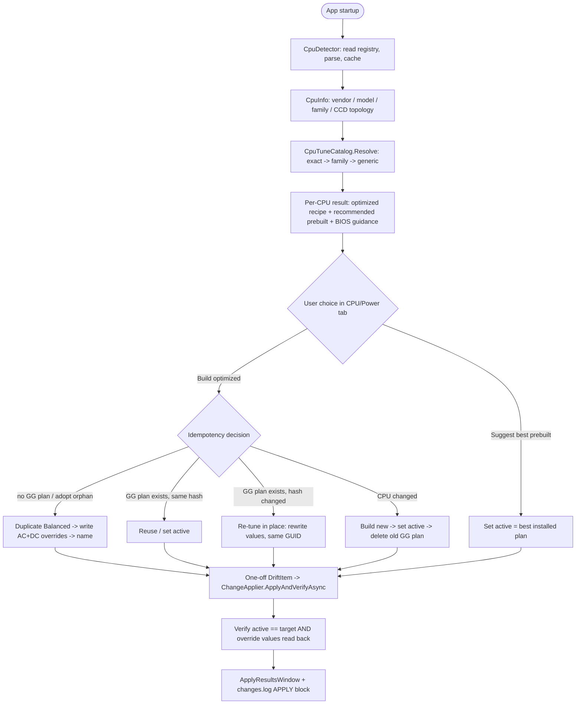

# feat: CPU-aware power plans + advisory BIOS guidance

## Summary

Detect the CPU once at startup (lightweight registry read, cached), then let the
user choose between switching to the best-matching prebuilt Windows plan or
having GamerGuardian build an optimized plan tuned for that CPU. Optimized
recipes come from a tiered, CCD-topology-aware catalog seeded with distinct
single-CCD (9800X3D) and dual-CCD (9950X3D) X3D entries, built as a Balanced
clone via new power-scheme-authoring P/Invoke, idempotent and reversible, wired
through the existing apply/verify/log machinery. Adds an advisory-only
Recommended BIOS settings tab keyed to the CPU, reworks the Recommended preset
to be CPU-aware (with a dual-CCD debloat guardrail), fixes a live hardcoded
power-scheme GUID bug, and documents everything across in-app, `docs/`, and the
wiki. Built and beta-tested via the `dev-build.yml` non-public pipeline before
public release.

---

## Problem Frame

The app currently recommends High Performance for every machine (see origin:
`docs/brainstorms/2026-06-03-cpu-aware-power-plans-requirements.md`). That is
wrong in two opposite directions for modern gaming CPUs:

- **Single-CCD X3D** (e.g. 9800X3D): High Performance fights the chip's boost
  and scheduling. The gaming-optimal tune is Balanced plus a few boost-friendly
  overrides (verified on the developer's own machine — the active plan is a
  Balanced clone with five processor overrides).
- **Dual-CCD X3D** (e.g. 9950X3D): High Performance is actively harmful — it
  disables the core parking the Xbox Game Bar + AMD 3D V-Cache Optimizer stack
  relies on to keep game threads on the cache CCD. Without it, threads spill to
  the frequency CCD and frame rates collapse.

So the correct plan depends on the specific silicon, and on dual-CCD parts the
power plan is necessary but not sufficient (it depends on a BIOS/driver/Game Bar
stack the app cannot set). The app should detect the CPU and produce the right
plan — precisely on known chips, sensibly on unknown ones — without growing
heavier or claiming optimizations it can't deliver, and without ever disturbing
Windows' built-in plans.

---

## Requirements Traceability

This plan covers origin requirements R1–R29 in full. Mapping to units:

- Detection (R1–R3) → U3
- Plan choice / suggest vs build (R4–R7) → U5 (builder + suggest-resolver, catalog from U4), U8 (UI presentation of the choice)
- Tune catalog + recipes (R8–R13) → U4
- Plan creation behavior / idempotent, reversible, logged (R14–R17) → U1, U5, U6
- Dual-CCD dependency surfacing (R18–R19) → U8
- Guardrails / CPU-aware preset (R20–R21) → U7
- BIOS guidance tab (R22–R24) → U9
- Documentation (R25–R26) → U6 (in-app), U10 (`docs/` + wiki)
- Footprint (R27–R28) → cross-cutting; enforced in U3, verified in U11
- Release sequencing (R29) → U11

Acceptance Examples AE1–AE7 are mapped to test scenarios in the relevant units
(see each unit's Test scenarios and the Acceptance Examples section).

---

## Key Technical Decisions

- **CPU detection by registry, not WMI.** Read `ProcessorNameString` /
  `VendorIdentifier` / `Identifier` from
  `HKLM\HARDWARE\DESCRIPTION\System\CentralProcessor\0` using the
  `Microsoft.Win32.Registry` API already used throughout the app. WMI
  (`Win32_Processor`) would add a `System.Management` dependency that violates
  the slim-app budget (R2/R27). No new dependency is introduced.

- **Tuning keys on cache asymmetry, not CCD count or marketing name.** The
  "park one CCD" rule applies ONLY to *asymmetric* dual-CCD X3D (one V-cache CCD
  among two — 7900X3D/7950X3D/9900X3D/9950X3D). Single-CCD parts, *symmetric*
  non-X3D dual-CCD parts (equal CCDs, no cache to prefer), and the *dual-V-cache*
  9950X3D2 (cache on both CCDs) all want parking *off*. CCD count alone is not the
  discriminator. Topology + parking strategy are derived from the model name via
  the catalog (no CPUID); a CPUID probe is deferred unless a future entry needs
  runtime topology the name can't provide.

- **High Performance / Ultimate personality is never recommended or built.**
  Every optimized plan is a Balanced clone, and the prebuilt suggestion is
  Balanced for all modern CPUs. The "gaming = High Performance" belief is
  outdated: HP pins minimum processor state to 100% and disables core parking,
  which fights modern boost algorithms (less single-core boost headroom, more
  heat → earlier thermal throttling) and on hybrid/X3D parts actively breaks
  Thread Director / CCD routing. The boost-friendly Balanced-clone tune captures
  HP's only real benefit (no downclock stutter — via a raised min state where
  wanted) without its costs. The deep-dive rationale is documented in U10.

- **Tunes + prebuilt recommendation + BIOS guidance are static catalog data,
  not a new monitor type.** Mirror `ServiceCatalog` / `WindowsAiAppCatalog`
  (`public static class` + `All`). Drift on the active scheme stays in the
  single existing `PowerPlanMonitor` (R17); the catalog is pure lookup data. Do
  not add to the `fixedMonitors` array.

- **Build/suggest run through the existing staged-apply + verify path.** Express
  the build-or-activate action as a one-off `DriftItem` and run it through
  `ChangeApplier.ApplyAndVerifyAsync` so it inherits the verify pass,
  `ApplyResult`, `ChangeLogger` APPLY block, and `ApplyResultsWindow` with a
  copyable verify command for free (R16). Staged in the Settings draft; commits
  on Apply/Save (R5).

- **Built plans are a Balanced clone; the app never touches built-in plans.**
  The base scheme is resolved by enumerating installed schemes and matching the
  well-known Balanced GUID/friendly name at runtime (per the repo's
  no-hardcoded-GUIDs rule), then duplicated. All prebuilt Windows plans remain
  installed and selectable; the app only ever creates, re-tunes, or deletes its
  own GG-authored plan.

- **Re-tune in place; keep delete off the hot path.** When the recipe changes
  for the same CPU, rewrite the existing GG plan's value indices in place (same
  GUID — drift bindings stay stable) instead of delete-and-rebuild.
  `PowerDeleteScheme` is reserved for the rare CPU-changed / orphan-cleanup case,
  sequenced **build-new → set-active → delete-old** so a failure never leaves the
  user with no plan, and it never deletes the currently-active scheme (Windows
  refuses that anyway).

- **Delete uses positive identity, not "not-Microsoft."** Before deleting, ALL
  must hold: the GUID equals the stored `BuiltSchemeGuid`, it is currently
  installed, AND its friendly name still matches the exact GG format
  (`GamerGuardian Gaming [<model>]`). If the name was changed, or the GUID is a
  user-authored custom plan, refuse to delete and fall through to create/adopt.
  This protects a user's hand-tuned plan — the real risk — not just Microsoft
  built-ins.

- **Idempotency keyed on machine + content hash, adopting orphans.** Persist the
  GG scheme GUID, a **content hash** of the resolved override set (subgroup +
  setting + value tuples + base + personality), and a **machine token**
  (`MachineGuid` from `HKLM\SOFTWARE\Microsoft\Cryptography`). The pure `Decide`
  function takes (stored state, detected CPU, **installed-plan set**) → Create /
  ReuseExisting / ReTune / Replace. Rules: stored GUID absent from the installed
  set → treat as no plan and clear the stale pref; before creating, scan
  installed plans for the GG friendly-name format and **adopt / re-tune rather
  than stacking a duplicate** (this is the root cause of the two identical
  "Gaming Balanced [9850X3D]" plans observed on the real machine); stored machine
  token ≠ current → treat the stored identity as foreign, never delete it,
  reconcile by local friendly-name scan; ReTune only when the content hash
  actually differs (a catalog refactor producing identical overrides →
  ReuseExisting, no churn).

- **AC and DC rails both written.** The gaming plan is single-personality: every
  recipe override is written to **both** AC and DC so the tune does not silently
  revert to Balanced defaults on battery (AMD X3D ships in handhelds, which are
  in scope — only Win10 is scoped out). Recipes carry one value per setting
  applied to both rails unless an entry explicitly marks a rail.

- **Verify reads back values, not just the active GUID.** `ChangeApplier`'s
  verify pass marks a setting verified only when it stops "drifting"; a bare
  `cpuplan` GUID-equality check would rubber-stamp success even if no override
  applied. So the `Apply` lambda verifies its own post-conditions — active scheme
  == target AND each override reads back via `PowerReadACValueIndex` — and throws
  on mismatch so `ChangeApplier` records a real failure. A half-written dual-CCD
  plan (missing `CPMINCORES=50`) must fail, not pass.

- **GUID hygiene fix (folded in per user decision).** Correct the wrong
  `PowerSaver` constant in `PowerPlanMonitor.cs` (code currently
  `a1841308-1541-…`; the real Windows value is `a1841308-3541-4fab-bc81-f71556f20b4a`)
  and remove the hardcoded High Performance GUID from `RecommendedPreset.cs`
  (required by R21). These are source-constant changes only — no effect on
  installed plans.

- **Dev-build-first via pipeline, not a runtime gate.** The feature ships in
  code normally. Private beta is delivered through the existing `dev-build.yml`
  non-public artifact pipeline; public release follows sign-off. No
  `IsDevBuild()` feature gate.

- **Elevation: spike in U1, single-batch fallback if needed.** Per-user
  power-scheme writes via `powrprof` typically do not need elevation, but
  duplicate / write-value / delete are likelier to be gated than activation — so
  the empirical check runs in U1 (test duplicate + write + read-back + delete,
  not just duplicate), before U5/U6 design hardens. If elevation is required, the
  fallback is a SINGLE elevated `powercfg` batch script run once under `runas`
  (one UAC prompt for the whole recipe), mirroring `ElevatedRegistry`'s
  shell-out style — never one prompt per value index. `Apply` must support either
  in-process or elevated-batch execution.

---

## High-Level Technical Design

Detection → choice → resolve → act, with the idempotent build decision:



Cache-asymmetry divergence (the load-bearing recipe difference):

```mermaid
flowchart LB
  X3D{Cache topology} -->|single-CCD / symmetric dual / dual-V-cache X3D2| S[Balanced base + Aggressive boost +<br/>no parking min cores = 100 +<br/>perf increase 60, idle demote 10, min state 5]
  X3D -->|asymmetric dual-CCD X3D e.g. 9950X3D| D[Balanced base + Aggressive boost +<br/>park frequency CCD min cores = 50 +<br/>max cores = 100; never min=100, never HighPerf personality]
  X3D -->|unknown| G[Generic: Balanced base + Aggressive boost +<br/>no core-parking override; labeled 'generic']
```

---

## Output Structure

New files (existing files modified in place are listed per unit):

```
src/GamerGuardian/
  Models/
    CpuInfo.cs                 # detected CPU shape (vendor/model/family/topology)
    CpuTuneDefinition.cs       # catalog entry: recipe + prebuilt reco + BIOS guidance
  Services/
    CpuDetector.cs             # registry read + pure Parse(); cached
    CpuTuneCatalog.cs          # static All + Resolve() tiering + topology + hash
    CpuPlanBuilder.cs          # idempotent build/re-tune + suggest-prebuilt resolver
    CpuPlanStatus.cs           # pure dual-CCD dependency-status function
  UI/
    CpuPowerTab.xaml(.cs)      # detected CPU + choice UI + dual-CCD deps  (or inline in SettingsWindow)
    BiosGuidanceTab.xaml(.cs)  # advisory-only static list  (or inline in SettingsWindow)
docs/
  CPU-AWARE-POWER-PLANS.md     # committed reference
  wiki/
    CPU-Power-Plans.md         # wiki page (+ _Sidebar.md entry)
tests/GamerGuardian.Tests/
  CpuDetectorTests.cs
  CpuTuneCatalogTests.cs
  CpuPlanBuilderTests.cs
  CpuPlanStatusTests.cs
  PowerPlanMonitorTests.cs   # U2: Power Saver GUID fix + base-scheme resolver
```

The per-unit `**Files:**` lists are authoritative; the implementer may inline the
two tabs into `SettingsWindow.xaml` rather than separate files if that fits the
existing tab structure better.

---

## Implementation Units

### Phase A — Foundations

### U1. Extend power P/Invoke for scheme authoring

- **Goal:** Add the native surface needed to clone a scheme, write setting
  values, name it, and delete it.
- **Requirements:** R7, R11, R12, R13, R15
- **Dependencies:** none
- **Files:** `src/GamerGuardian/Native/Powrprof.cs` (modify)
- **Approach:** Add P/Invoke + `static` helpers, mirroring the file's existing
  marshalling. Spell out the signatures — this is the highest-risk surface and
  "mirror existing patterns" does not cover these shapes:
  - `PowerDuplicateScheme(IntPtr RootKey, ref Guid SourceScheme, ref IntPtr DestScheme)`
    — the new GUID returns as a `LocalFree`-owned `IntPtr`; `PtrToStructure<Guid>`
    then `LocalFree` (mirror `GetActiveScheme`'s try/finally), not a `ref Guid` out.
  - `PowerWriteACValueIndex(IntPtr, ref Guid Scheme, ref Guid Sub, ref Guid Setting, uint Index)`
    and `PowerWriteDCValueIndex(...)` — three `ref Guid` + a `DWORD`.
  - `PowerReadACValueIndex(IntPtr, ref Guid Scheme, ref Guid Sub, ref Guid Setting, out uint Index)`
    — required for the read-back verify (see KTD).
  - `PowerWriteFriendlyName(IntPtr, ref Guid Scheme, IntPtr Sub, IntPtr Setting, byte[] Buffer, uint BufferSize)`
    — takes a Unicode, null-terminated byte buffer **plus byte count**, not a
    marshalled `string`; it is the inverse of the existing `PowerReadFriendlyName`.
  - `PowerDeleteScheme(IntPtr, ref Guid Scheme)`.
  Helpers: `DuplicateScheme(Guid source) -> Guid`,
  `WriteValue(Guid scheme, Guid sub, Guid setting, uint value)` (writes BOTH AC
  and DC rails per KTD), `ReadAcValue(...)`, `WriteFriendlyName(Guid, string)`,
  `DeleteScheme(Guid)`. Add the processor subgroup GUID
  (`54533251-82be-4824-96c1-47b60b740d00`) and the seven setting GUIDs (core
  parking min/max cores, boost mode, perf increase threshold, idle demote
  threshold, min/max processor state) as documented Microsoft well-known
  constants — distinct from the *scheme* GUIDs the no-hardcode rule governs.
  After editing, Grep each new GUID/signature to confirm the change landed (repo
  gotcha: Edit can silently no-op).
- **Patterns to follow:** existing imports/helpers in `Native/Powrprof.cs`.
- **Execution note:** Run the elevation spike here (KTD): a manual scratch
  sequence that duplicates Balanced, writes a value, reads it back, sets active,
  and deletes the scratch scheme — confirming whether any call needs elevation
  before U5/U6 design hardens.
- **Test scenarios:** Test expectation: none — thin P/Invoke wrappers, exercised
  indirectly via U5. Keep all logic out of this file so it needs no unit test.
- **Verification:** builds warning-clean; the scratch sequence
  duplicates/writes/reads-back/sets-active/deletes successfully; the elevation
  requirement is recorded for U5; each new setting GUID confirmed via Grep.

### U2. Fix power-scheme GUID hygiene

- **Goal:** Correct the wrong Power Saver constant and add a runtime resolver for
  well-known base schemes, satisfying the repo's no-hardcoded-scheme-GUIDs rule.
- **Requirements:** advances R13 (Balanced base resolution); fixes a latent bug
  noted in origin Sources.
- **Dependencies:** none
- **Files:** `src/GamerGuardian/Monitors/PowerPlanMonitor.cs` (modify),
  `tests/GamerGuardian.Tests/PowerPlanMonitorTests.cs` (new)
- **Approach:** Replace the wrong `PowerSaver` GUID
  (`a1841308-1541-…` → `a1841308-3541-4fab-bc81-f71556f20b4a`). Add a helper that
  resolves a base scheme GUID by enumerating installed schemes and matching the
  well-known GUID, with friendly-name fallback, rather than trusting a hardcoded
  constant — used by U5 to find Balanced. Leave the Balanced/HighPerformance/
  Ultimate constants as documented Microsoft well-known values used only as
  enumeration match targets, never as the sole source of truth.
- **Patterns to follow:** `ListAvailablePlans()` / `EnumerateSchemes()` already
  in this file.
- **Test scenarios:**
  - Power Saver constant equals the real Windows Power Saver GUID
    (`a1841308-3541-…`), guarding against regression of the old wrong value.
  - Base-scheme resolver returns the Balanced GUID when Balanced is installed
    (drive via a seam that lists known schemes), and a not-found signal when
    absent — without throwing.
  - Existing-behavior guard: `ToGuid(PowerPlanChoice.PowerSaver)` returns the
    corrected GUID (not the old wrong value) and `ToGuid(PowerPlanChoice.Balanced)`
    is unchanged — confirms the fix didn't slip the `ToGuid` switch.
- **Verification:** new test passes; selecting Power Saver as desired now
  resolves to a real installed GUID.

### U3. CPU detection

- **Goal:** Detect the CPU once at startup and expose a cached, parsed `CpuInfo`.
- **Requirements:** R1, R2, R3; footprint R27
- **Dependencies:** none
- **Files:** `src/GamerGuardian/Models/CpuInfo.cs` (new),
  `src/GamerGuardian/Services/CpuDetector.cs` (new),
  `tests/GamerGuardian.Tests/CpuDetectorTests.cs` (new)
- **Approach:** `CpuInfo` record carries vendor, raw model string, normalized
  model (e.g. `9800X3D`), and family/microarch tag. **Topology ownership:** to
  avoid U3 and U4 both classifying CCD topology, `CpuDetector` does NOT decide
  single-vs-dual — it produces vendor/model/family only, and U4's catalog assigns
  `CcdTopology` and parking strategy during `Resolve` from its model
  classification. Normalization rule: extract the AMD model token from
  `ProcessorNameString` via regex (the Ryzen model pattern, e.g. capturing
  `\b\d{3,4}(X3D2|X3D|XT|X|GE|G|F)?\b` after "Ryzen"), upper-cased and trimmed —
  the pattern MUST keep the `X3D2` dual-edition suffix distinct from `X3D`
  (9950X3D2 ≠ 9950X3D; they take opposite parking). `CpuDetector` reads the registry `CentralProcessor\0` values and
  delegates to a **pure** `static CpuInfo Parse(string nameString, string
  vendorId, string identifier)` so classification is unit-testable with no
  registry access. Expose the result as a `static Lazy<CpuInfo>` (cached, no
  timer/thread); first access can be lazy on UI open to avoid startup cost.
- **Patterns to follow:** monitors keeping `ReadCurrent`/`Apply` static;
  `Microsoft.Win32.Registry` usage across `Monitors/`.
- **Test scenarios:**
  - "AMD Ryzen 7 9800X3D" → vendor AMD, normalized model `9800X3D`.
  - "AMD Ryzen 9 9950X3D" → vendor AMD, normalized model `9950X3D`.
  - "AMD Ryzen 9 7950X3D" → vendor AMD, model `7950X3D`.
  - An unrecognized string (e.g. "Intel Core i5-9400F") → vendor Intel, model
    preserved/best-effort, no throw.
  - Empty/garbage name string → vendor Unknown, no throw.
  - Whitespace/casing variations of the X3D names normalize identically.
  - "AMD Ryzen 9 9950X3D2" normalizes to `9950X3D2` (distinct from `9950X3D`).
  - Topology and parking strategy are asserted in U4, which owns model
    classification — U3 does not classify them.
- **Verification:** parser tests pass; detection adds no new dependency and no
  new background thread.

### U4. CPU tune catalog + tiered resolution

- **Goal:** Static catalog of per-CPU optimized recipes, recommended prebuilt
  plans, and BIOS guidance, with exact → family → generic resolution.
- **Requirements:** R8, R9, R10, R11, R12, R13, R22, R24; suggest-prebuilt input
  for R6
- **Dependencies:** U3
- **Files:** `src/GamerGuardian/Models/CpuTuneDefinition.cs` (new),
  `src/GamerGuardian/Services/CpuTuneCatalog.cs` (new),
  `tests/GamerGuardian.Tests/CpuTuneCatalogTests.cs` (new)
- **Approach:** `CpuTuneDefinition` carries: match key + tier (exact / family /
  generic), an ordered list of processor overrides (subgroup + setting + value,
  applied to **both AC and DC** rails per KTD), a `RecommendedPrebuilt` choice
  (which existing Windows plan to suggest), a `GenericLabeled` flag, and a list of
  BIOS recommendation entries (name, recommended value, rationale).
  `CpuTuneCatalog` exposes `All`, owns CPU model classification (physical CCD
  topology AND the **park-frequency-CCD set** — the asymmetric dual-CCD X3D parts
  `{9950X3D, 9900X3D, 7950X3D, 7900X3D}` whose tune parks the non-cache CCD), and
  `Resolve(CpuInfo) -> CpuTuneResult`. `Resolve` assigns topology + parking
  strategy (the catalog is the single owner — see U3), selects the recipe, and
  exposes a **content hash** of the resolved override set (used by U5's `Decide`).
  **Parking principle:** "park one CCD" keys on *cache asymmetry* (one V-cache CCD
  among two), NOT raw CCD count — single-CCD, symmetric non-X3D dual, and the
  dual-V-cache 9950X3D2 all want **no parking**; only asymmetric dual-CCD X3D
  parks. All entries use a Balanced base; none use a High Performance personality
  (see KTD). Seed:
  - **9800X3D (exact, single-CCD):** Balanced base; boost = Aggressive; core
    parking min cores = 100 (no parking); perf increase threshold = 60; idle
    demote threshold = 10; min processor state = 5; max processor state = 100 (R11).
  - **9950X3D (exact, asymmetric dual-CCD):** Balanced base/personality; boost =
    Aggressive; core parking min cores = 50 (park frequency CCD); max cores = 100
    (R12). Invariant: never min = 100, never HighPerformance personality.
  - **9950X3D2 "Dual Edition" (exact, dual V-cache):** cache on BOTH CCDs → treat
    like single-CCD — **no parking** (min cores = 100), boost = Aggressive, max =
    100. Exact entry so the asymmetric-dual rule never mis-parks a cache CCD.
  - **v1 family tiers (fixed roster — additional families deferred):**
    - single-CCD Zen4/Zen5 X3D (e.g. 7800X3D) → single-CCD recipe (no parking).
    - asymmetric dual-CCD Zen4/Zen5 X3D (7950X3D / 7900X3D / 9900X3D) → dual-CCD
      recipe (park frequency CCD, min cores = 50).
    - **modern non-X3D Ryzen (Zen4/Zen5)** → boost = Aggressive, **no parking**
      (min cores = 100), max = 100; recommend Balanced. Covers single-CCD
      (7600X/7700X/9600X/9700X) and *symmetric* dual-CCD (7900X/7950X/9900X/9950X)
      — symmetric dual has no cache CCD to prefer, so it must NOT park.
    - **modern Intel hybrid P+E (12th–14th gen / Core Ultra 200S)** → Balanced
      base + boost = Aggressive, **no core-parking override** (leave Balanced's
      parking so Thread Director + Game Bar keep managing P/E cores); recommend
      Balanced. A real built recipe, not just a suggestion.
  - **Generic:** Balanced base + Aggressive boost + no core-parking override,
    `GenericLabeled = true` (R9).
- **Patterns to follow:** `Services/ServiceCatalog.cs`, `WindowsAiAppCatalog`.
- **Test scenarios:**
  - Covers AE1. Resolve(9800X3D) → exact tier, topology Single, the exact R11
    overrides; core parking min cores = 100.
  - Covers AE2. Resolve(9950X3D) → exact tier, asymmetric dual-CCD, min cores =
    50, max cores = 100; assert min cores ≠ 100 and personality Balanced.
  - Resolve(9950X3D2) → exact, **no parking** (min cores = 100) despite two
    physical CCDs (dual V-cache); never min = 50.
  - Resolve(7950X3D) → asymmetric dual-CCD family recipe (min cores = 50), not
    generic.
  - Resolve(7700X / 9700X, non-X3D single-CCD) → no parking (min 100), recommend
    Balanced, not `GenericLabeled`.
  - Resolve(7950X / 9950X, non-X3D *symmetric* dual-CCD) → **no parking**
    (min 100), NOT min 50 — guards against mis-parking a symmetric chip.
  - Resolve(Intel hybrid, e.g. Core Ultra 9 285K / i7-14700K) → built recipe with
    no core-parking override, recommend Balanced, not `GenericLabeled`.
  - Covers AE3. Resolve(Unknown) → generic, topology Unknown,
    `GenericLabeled = true`, no core-parking override present.
  - Content hash is deterministic and identical for two definitions with the same
    resolved override set, and differs when any value changes (drives U5 ReTune
    vs ReuseExisting).
  - Every override is present on both AC and DC rails.
  - No entry uses a High Performance personality; the prebuilt recommendation is
    Balanced for every entry.
  - Catalog invariants (mirror `ServiceCatalogTests`): non-empty; no duplicate
    keys; every recipe has a Balanced base and ≥1 override or is the generic;
    every override value within valid range (0–100 for percentages); a generic
    tier exists; every entry has a `RecommendedPrebuilt`.
  - Parking guard: ONLY asymmetric dual-CCD X3D entries (9950X3D, 9900X3D,
    7950X3D, 7900X3D) set min cores = 50; every other entry (single-CCD, non-X3D
    dual, 9950X3D2) leaves min cores ≥ 100 / no park override.
- **Verification:** catalog tests pass; resolution is OS-independent.

### Phase B — Core logic

### U5. Plan builder + suggest resolver + config

- **Goal:** Idempotently build/re-tune the optimized plan, resolve the best
  prebuilt plan, and persist plan identity — never duplicating, never deleting a
  built-in or a user's custom plan.
- **Requirements:** R6, R7, R14, R15
- **Dependencies:** U1, U2, U4
- **Files:** `src/GamerGuardian/Services/CpuPlanBuilder.cs` (new),
  `src/GamerGuardian/Models/AppConfig.cs` (modify — add `CpuPlanPref` **nested
  under `GlobalPreferences`** so it rides the existing `Global` clone — no
  `AppConfigCloner` change needed),
  `tests/GamerGuardian.Tests/CpuPlanBuilderTests.cs` (new)
  - *Conditional (only if the elevation spike in U1 shows writes need
    elevation):* `src/GamerGuardian/Services/ElevatedRegistry.cs` (modify — add a
    `RunPowercfgBatch(string script)` helper) consumed by `BuildOrActivate`.
- **Approach:** Add `CpuPlanPref` (nested under `GlobalPreferences`) capturing the
  built scheme GUID, the recipe **content hash**, and a **machine token**
  (`MachineGuid`). `CpuPlanBuilder` exposes:
  - A **pure** `BuildDecision Decide(CpuPlanPref existing, CpuInfo cpu,
    CpuTuneResult recipe, IReadOnlyCollection<InstalledPlan> installed)` →
    Create / ReuseExisting / ReTune / Replace. Rules (KTD): stored GUID missing
    from `installed` → clear stale pref, treat as no plan; before Create, scan
    `installed` for the GG friendly-name format and **adopt** (ReTune) instead of
    stacking a duplicate; stored machine token ≠ current → foreign, never delete,
    reconcile by local name scan; hash matches → ReuseExisting; hash differs,
    same CPU → ReTune in place (same GUID, rewrite values); CPU changed → Replace.
  - `BuildOrActivate(...)`: per decision — Create duplicates the Balanced base
    (resolved via U2), writes AC+DC overrides, names the scheme
    (`GamerGuardian Gaming [<model>]`), sets active, persists identity; ReTune
    rewrites value indices on the existing GUID and sets active; Replace builds
    the new plan, sets it active, **then** deletes the old GG plan. **Partial-
    failure cleanup:** on any failure after a duplicate, delete the just-created
    scratch scheme (guarded) and do not persist its GUID, so retry is clean.
  - A **pure** `bool MaySafelyDelete(Guid stored, IReadOnlyCollection<InstalledPlan> installed)`
    requiring positive identity (KTD): GUID == stored, installed, friendly name
    matches the GG format, and not a well-known Microsoft GUID.
  - `BestPrebuilt(CpuInfo, installedPlans)` → recommended installed plan GUID (R6),
    creating nothing.
- **Patterns to follow:** `RecommendedPreset` mutate-draft + log style;
  `PowerPlanMonitor.ListAvailablePlans()`.
- **Execution note:** Confirm the U1 elevation result first; then implement
  `Decide` and `MaySafelyDelete` test-first — they are the correctness core
  (idempotency + never-delete-someone-elses-plan).
- **Test scenarios:**
  - Covers AE4. Decide, no stored GG plan, none installed → Create.
  - Covers AE4. Decide, stored GG plan, hash matches → ReuseExisting (no
    duplicate).
  - Decide, stored GG plan, hash differs, same CPU → ReTune (same GUID, no
    delete).
  - Decide, stored GUID absent from installed set → pref cleared, Create.
  - Decide, no stored pref but an installed plan matches the GG name format →
    adopt/ReTune, not a second plan (reproduces & prevents the observed
    duplicate-stacking bug).
  - Decide, stored machine token ≠ current → no delete, local reconcile.
  - Decide, catalog refactored but resolved override set identical (same hash) →
    ReuseExisting, no churn.
  - `MaySafelyDelete` false when: GUID is a Microsoft well-known plan; friendly
    name no longer matches the GG format (user renamed it); GUID not installed.
    True only when all positive-identity conditions hold.
  - `BestPrebuilt(9950X3D, …)` → Balanced; `BestPrebuilt(unknown modern, …)` →
    Balanced; never returns a GUID absent from the installed set.
  - Config round-trips `CpuPlanPref` (serialize/deserialize) under `Global`.
- **Verification:** builder tests pass; building twice yields exactly one GG
  plan; ReTune keeps the same GUID; a renamed/custom plan is never deleted;
  built-in plans remain present (dev smoke check by enumeration).

### U6. Apply integration + in-app docs data

- **Goal:** Route build/suggest through apply+verify+log, and supply the in-app
  Mechanism/Apply/Verify text + Learn More entry.
- **Requirements:** R16, R17, R25, R26
- **Dependencies:** U5
- **Files:** `src/GamerGuardian/Services/SettingDocs.cs` (modify),
  `src/GamerGuardian/Services/SettingDocsCatalog.cs` (modify),
  `src/GamerGuardian/Models/SettingDetails.cs` (reuse),
  `docs/SETTINGS-REFERENCE.md` (regenerate via `--gen-docs`),
  `tests/GamerGuardian.Tests/SettingDocsCatalogTests.cs` (modify),
  `tests/GamerGuardian.Tests/SettingDocsTests.cs` (modify),
  `tests/GamerGuardian.Tests/ApplyCommandTests.cs` (modify)
- **Approach:** Provide a helper that wraps a build-or-activate action as a
  one-off `DriftItem` (SettingId `cpuplan`, `RawBefore` = active scheme GUID,
  `RawDesired` = target GUID + override summary, `Apply` = the U5 call) and runs
  it through `ChangeApplier.ApplyAndVerifyAsync` for the `ApplyResult` +
  `ChangeLogger` APPLY block + `ApplyResultsWindow`. **Critical (feasibility):**
  `ChangeApplier`'s verify pass only re-runs `CheckDrift` on the monitors it's
  given, and no monitor emits `cpuplan` — so it would mark the action verified
  unconditionally. The post-condition check therefore lives **inside the `Apply`
  lambda**: confirm active scheme == target AND read each override back via
  `PowerReadACValueIndex`; throw on mismatch so `ChangeApplier` records the error
  and `verified` becomes false. Add `cpuplan` cases to `MechanismFor`
  (`powrprof PowerDuplicateScheme + PowerWriteACValueIndex`) and
  `VerifyCommandFor` (`powercfg /getactivescheme` + `powercfg /query <guid>
  SUB_PROCESSOR`). `ApplyCommandFor` returns a **template** with placeholders
  (`powercfg -duplicatescheme <balanced-guid> ; powercfg -setacvalueindex <new-guid> …`)
  — it stays a static string per the existing `SettingDocs` contract; the actual
  runtime GUIDs appear in `changes.log` / `ApplyResultsWindow`, and the R26
  "exact overrides and why" obligation is discharged by the `SettingDocsCatalog`
  entry and `docs/CPU-AWARE-POWER-PLANS.md`, not by `ApplyCommandFor`. Add a
  `SettingDocsCatalog` `SettingDetails` entry for `cpuplan` (it lands in the
  generator's "Global gaming + display" bucket unless a new section is added to
  `SettingsReferenceGen`; acceptable for v1 — note the bucket so the regenerated
  diff isn't a surprise). **Then** regenerate the doc in this order or CI fails:
  `dotnet build`, then `dotnet run --project src\GamerGuardian -- --gen-docs docs/SETTINGS-REFERENCE.md`,
  then commit the regenerated file.
- **Patterns to follow:** existing `powerplan` entries in `SettingDocs` and
  `SettingDocsCatalog`; `ChangeApplier`/`ApplyResultsWindow` usage.
- **Test scenarios:**
  - `MechanismFor("cpuplan")`, `VerifyCommandFor("cpuplan")` return non-empty,
    correctly-shaped strings; `ApplyCommandFor` reflects the override set.
  - `SettingDocsCatalog.Get("cpuplan")` populated (all fields non-empty, ≥2
    scenarios); `cpuplan` added to the coverage `[InlineData]` theory.
  - `SettingsReferenceMd_MatchesCatalogOutput` passes after regeneration.
- **Verification:** apply of a build produces an APPLY block in `changes.log` and
  an ApplyResults row with a working verify command; docs test green.

### U7. CPU-aware Recommended preset + dual-CCD debloat guardrail

- **Goal:** Make the preset pick the CPU-appropriate plan (not blind High
  Performance) and never disable Game Bar / the AMD V-Cache service on dual-CCD.
- **Requirements:** R20, R21
- **Dependencies:** U4, U5
- **Files:** `src/GamerGuardian/Services/RecommendedPreset.cs` (modify),
  `src/GamerGuardian/Services/ServiceCatalog.cs` (review; modify only if needed),
  `tests/GamerGuardian.Tests/RecommendedPresetTests.cs` (modify)
- **Approach:** Replace `SetPowerPlan`'s hardcoded High Performance with a
  CPU-aware choice driven by `CpuTuneCatalog.Resolve` + `CpuPlanBuilder`
  (offer/select the optimized plan or the recommended prebuilt; preserve the
  existing "leave a user's custom plan alone" conservatism). Remove the hardcoded
  `HighPerformanceGuid` constant. Add the guardrail: when topology is dual-CCD
  X3D, the preset must not set Xbox Game Bar or the AMD 3D V-Cache Optimizer
  service to a disabled target — exclude them from the applied set for that CPU
  class. Keep the preset's existing conservative omissions (Memory Integrity,
  UWP removal).
- **Patterns to follow:** existing `RecommendedPreset` count/log/draft-mutation
  style.
- **Test scenarios:**
  - Covers AE6. On dual-CCD X3D, the preset result does not disable Xbox Game Bar
    or the AMD 3D V-Cache Optimizer service.
  - On single-CCD / non-X3D, preset still applies its normal service targets.
  - Preset power-plan step is no longer unconditionally High Performance
    (assert it reflects the resolved CPU recommendation).
  - Idempotent re-run reports already-correct for unchanged items.
- **Verification:** updated `RecommendedPresetTests` pass; no hardcoded
  High Performance GUID remains (grep).

### Phase C — UI and docs

### U8. CPU / Power tab (detection display + choice + dual-CCD deps)

- **Goal:** Show the detected CPU and present the two-action choice, surfacing
  dual-CCD dependencies honestly.
- **Requirements:** R4, R5, R6, R7, R18, R19
- **Dependencies:** U4, U5, U6
- **Files:** `src/GamerGuardian/UI/SettingsWindow.xaml` (modify — add tab),
  `src/GamerGuardian/UI/SettingsWindow.xaml.cs` (modify — handlers/VM),
  `src/GamerGuardian/Services/CpuPlanStatus.cs` (new — pure dependency-status
  function), `tests/GamerGuardian.Tests/CpuPlanStatusTests.cs` (new)
- **Approach:** Add a "CPU / Power" `TabItem` showing detected vendor/model/
  topology/tier and two `ui:Button`s: *Suggest best prebuilt plan* and *Build
  optimized plan*.
  - **Apply model (resolves the staged-vs-immediate contradiction): immediate
    apply.** Both buttons are side-effecting actions that call the U6 apply helper
    now (not staged to `_draft`), guarded by the existing `_applyInFlight` flag +
    `SetButtonsEnabled(false)` so a second click or a concurrent main Apply can't
    race. While running, the clicked button shows "Building…/Applying…" and
    reverts on completion or error.
  - **Config ordering:** only on a successful verify, write
    `_draft.Global.PowerPlan.DesiredGuid`/`DesiredName` to the target GUID and
    persist, so the existing `PowerPlanMonitor` watches it afterward (R17); on
    failure leave `DesiredGuid` unchanged.
  - **Cancel semantics:** a scheme already built stays installed (the user can
    switch back via the existing Power plan combo); Cancel does not roll back a
    completed build.
  - **Errors** surface via `MessageBox.Show` (following
    `ApplyRecommendedPresetButton_Click`), covering UAC/elevation declined,
    Balanced base not found (U2 resolver), build-API failure, and verify mismatch.
  - **Detection-failed state:** if `CpuInfo` vendor is Unknown / model
    unparseable, the CPU line reads "CPU: not detected — using generic tune" and
    both buttons stay enabled offering the generic recipe.
  - **Dual-CCD dependency panel (R18/R19):** rendered only for dual-CCD topology,
    in two visual tiers — *checkable* (AMD 3D V-Cache Optimizer service
    running/stopped via the existing service controller; Game Bar enabled via
    `HKCU\Software\Microsoft\GameBar\AutoGameModeEnabled`) with a met/unmet/Unknown
    icon, and *advisory* (BIOS CPPC = Driver) with an "Advisory — cannot be read"
    label and no icon. Read once on tab-first-activation (lazy); no auto-refresh —
    include a "restart to re-check" note; show "Not installed/Unknown" when the
    service read returns null/throws. The optimized-status verdict comes from the
    pure, tested `CpuPlanStatus.DependencyStatus(planActive, serviceState,
    gameBarEnabled) -> {Met, PartlyUnmet, Unknown}` — it never returns an
    unqualified "optimized ✓" (BIOS CPPC is always unverifiable, so dual-CCD never
    claims fully-confirmed). Respect `_suppressSaveOnClose`.
- **Patterns to follow:** the hand-wired Power plan card (`PowerPlanCombo` +
  handlers); `ApplyRecommendedPresetButton_Click` (imperative apply + try/catch +
  MessageBox); `_applyInFlight`/`SetButtonsEnabled`; service-state reads in
  `WindowsServiceController`.
- **Test scenarios:**
  - Covers AE5. `CpuPlanStatus.DependencyStatus`: plan active + service running →
    Met (still surfaces "verify BIOS CPPC/Game Bar"); plan active + service
    stopped → PartlyUnmet (dependency unmet surfaced); service Unknown/uninstalled
    → Unknown. Pure function, unit-tested — never an unqualified "optimized ✓".
  - Remaining UI behavior: Test expectation: none — WPF UI not unit-tested per
    repo convention; verified manually (dev-build smoke on 9800X3D and 9950X3D).
- **Verification:** manual — on each machine the tab shows the right CPU, both
  actions apply with in-progress/error feedback, the dual-CCD panel renders the
  two tiers correctly, a forced verify-mismatch surfaces an error, built-ins
  remain present, `changes.log` records the apply.

### U9. Advisory Recommended BIOS settings tab

- **Goal:** Static, advisory-only BIOS guidance keyed to the detected CPU.
- **Requirements:** R22, R23, R24
- **Dependencies:** U3, U4
- **Files:** `src/GamerGuardian/UI/SettingsWindow.xaml` (modify — add tab),
  `src/GamerGuardian/UI/SettingsWindow.xaml.cs` (modify — bind catalog data)
- **Approach:** Add a "Recommended BIOS" `TabItem` that renders the resolved
  CPU's BIOS guidance entries (name, recommended value, rationale) as a static
  `ItemsControl`/cards. No Monitor/Want/Apply controls, **no current-state
  column**, and a prominent advisory label ("Advisory only — verify against your
  motherboard manual"). For dual-CCD X3D include CPPC Dynamic Preferred Cores =
  Driver with its rationale. **Empty/unknown state:** when the resolved entry has
  no BIOS guidance rows (e.g. generic tier or detection failed), render the
  advisory label plus a single informational card — "No CPU-specific BIOS
  recommendations are available for your processor." — never a blank
  `ItemsControl` (which reads as broken).
- **Patterns to follow:** read-only data-templated `ItemsControl` + `ui:Card`
  lists already in `SettingsWindow.xaml`.
- **Test scenarios:** Test expectation: none — static UI bound to catalog data
  (catalog content asserted in U4); verify manually that no state column or
  "applied" claim appears.
- **Verification:** manual — tab shows per-CPU advice with the advisory label and
  no state/apply affordance.

### U10. Committed docs + wiki

- **Goal:** Detailed `docs/` and wiki documentation of detection and every plan's
  settings.
- **Requirements:** R25, R26
- **Dependencies:** U3, U4, U5
- **Files:** `docs/CPU-AWARE-POWER-PLANS.md` (new),
  `docs/wiki/CPU-Power-Plans.md` (new), `docs/wiki/_Sidebar.md` (modify)
- **Approach:** Write a committed reference explaining detection, the tiered
  match logic, each seeded recipe's exact overrides and *why*, the
  cache-asymmetry divergence (single-CCD vs asymmetric-dual-CCD X3D vs
  symmetric/dual-V-cache), the dual-CCD dependency stack (BIOS/driver/Game Bar),
  the prebuilt-vs-optimized choice, the never-touch-built-ins guarantee, and a
  **"Why not High Performance / Ultimate?"** section (the belief is outdated for
  modern boost-managed CPUs; HP pins min state 100% and kills core parking →
  fights boost headroom, raises heat, and breaks Thread Director / X3D CCD
  routing; the Balanced-clone tune captures HP's only real benefit without the
  costs). Mirror it into a wiki page and add it to `_Sidebar.md`. Keep
  PowerShell-5.1 compatibility assumptions for `tools/sync-wiki.ps1` (publish step
  is manual).
- **Patterns to follow:** existing `docs/` design docs and `docs/wiki/*.md`
  structure.
- **Test scenarios:** Test expectation: none — documentation. (In-app docs and
  `SETTINGS-REFERENCE.md` are covered by U6.)
- **Verification:** docs read correctly; wiki sidebar links resolve;
  `sync-wiki.ps1` dry-run succeeds.

### U11. Footprint verification + dev-build beta delivery

- **Goal:** Prove the slim-app budget is met and deliver the private beta via the
  existing pipeline.
- **Requirements:** R27, R28, R29
- **Dependencies:** U1–U10
- **Files:** none (measurement + CI artifact); record results in
  `docs/CPU-AWARE-POWER-PLANS.md`
- **Approach:** Build the published single-file artifact at the feature branch
  HEAD and compare against the pre-feature `main` baseline (record the baseline
  commit SHA in `docs/CPU-AWARE-POWER-PLANS.md`). Binary size: ≤ ~0.5 MB growth
  (objective). Idle working set (falsifiable procedure): measure at 5 minutes
  post-launch, three runs each for baseline and feature, discard outliers, compare
  means; accept if the mean delta is ≤ 3 MB. Confirm the software-rendered-WPF /
  Mica-off behavior is intact (R28). Deliver the private beta through the
  `dev-build.yml` non-public artifact pipeline (push the feature branch; it
  produces installer + portable EXE artifacts, no public release), beta-test on
  the 9800X3D and 9950X3D, then promote to a public release after sign-off (R29).
- **Patterns to follow:** `.github/workflows/dev-build.yml`; the dev-build
  invariant checklist (version reads `(dev)`, Run key untouched, no update popup,
  normal `changes.log`).
- **Test scenarios:** Test expectation: none — measurement/release activity, not
  code behavior.
- **Verification:** measured deltas within budget and recorded; dev-build
  artifact installs and runs on both machines; built-in plans confirmed present
  after using the feature.

---

## Scope Boundaries

### Deferred for later (from origin)

- Broad family-tier coverage beyond the two seeded exact models and a minimal
  starter set of families (which families ship in v1 is decided during U4).

### Outside this product's identity (from origin)

- Capturing/importing an existing custom plan or `.pow` file (catalog-authored
  only).
- Per-game / per-application dynamic plan switching.
- GPU / graphics-driver-level tuning.
- Reading or applying BIOS state (BIOS guidance is advisory-only).
- In-app user authoring/editing of custom recipes.
- Windows 10 support.

### Deferred to Follow-Up Work (plan-local)

- A CPUID-based topology detector, only if a future catalog entry needs runtime
  CCD detection that the model string can't provide.
- Light detection of the readable BIOS-dependency subset (memory clock vs rated,
  SMT, virtualization) as state hints — explicitly deferred in the brainstorm in
  favor of advisory-only.
- Capturing the power-API-elevation finding and the GUID-resolution pattern as a
  committed `docs/solutions/` learning (none exists yet) via `/ce-compound`.

---

## System-Wide Impact

- **Recommended preset behavior changes** (R21): existing users who run the
  preset will get a CPU-appropriate plan instead of High Performance. Documented
  in U10 and the in-app docs.
- **Config schema grows** by a `CpuPlanPref` block; older configs deserialize
  with defaults (no migration needed). Must be reflected in `AppConfigCloner`.
- **Service-disable interaction** (R20): the preset's service set becomes
  CPU-conditional for dual-CCD X3D. No change for other CPUs.
- **No new always-on work**: detection is one-time/cached; drift reuses the
  existing 30s poll.

---

## Risks & Dependencies

- **Power-scheme writes may require elevation.** Assumed not (per-user
  `powrprof`), but unconfirmed. Mitigation: spike in U1 (test write + delete, not
  just duplicate); if required, a single elevated `powercfg` batch under `runas`
  (one UAC prompt), not per-value.
- **Partial build failure** (a write or delete fails mid-sequence) could orphan a
  half-tuned scheme — for dual-CCD, a missing `CPMINCORES=50` is the exact
  harmful state the feature prevents. Mitigation: read-back verify throws on
  mismatch (U6); build-new→activate→delete-old ordering and scratch cleanup on
  failure (U5).
- **Roamed/shared `config.json` across the dev's two machines** would otherwise
  cause duplicate-and-delete churn (scheme GUIDs are machine-local). Mitigation:
  machine-token binding in `CpuPlanPref` (U5) — foreign identities are never
  deleted, reconciled by local name scan.
- **DC/battery rail** could silently run unoptimized if only AC were written.
  Mitigation: write every override to both AC and DC (KTD, U4).
- **Edit tool can silently no-op** on critical blocks (repo gotcha). Mitigation:
  Grep to confirm after each edit to `Powrprof.cs`, `PowerPlanMonitor.cs`,
  `RecommendedPreset.cs`.
- **`SETTINGS-REFERENCE.md` drift** breaks CI. Mitigation: regenerate via
  `--gen-docs` whenever `SettingDocsCatalog` changes (U6).
- **`TreatWarningsAsErrors`**: keep nullable-clean, no unused usings.
- **Dual-CCD correctness depends on an external stack** (BIOS/driver/Game Bar)
  the app can't control — surfaced, not guaranteed (R18/R19).
- **External dependency:** beta validation requires physical access to a 9800X3D
  and a 9950X3D (the developer's machines).

---

## Acceptance Examples (origin → coverage)

- AE1 (single-CCD exact build) → U3 detection test + U4 resolution test +
  U5 build path.
- AE2 (dual-CCD exact build, min cores 50, Balanced personality) → U3 + U4
  tests with the dual-CCD guard.
- AE3 (unknown CPU still offers both; generic labeled) → U3 + U4 generic tests;
  U8 UI.
- AE4 (idempotent build, no duplicate) → U5 `Decide` tests.
- AE5 (dual-CCD unmet dependency → surfaced, no false "optimized") → U8
  `CpuPlanStatus.DependencyStatus` pure unit test + manual UI verification.
- AE6 (debloat guardrail) → U7 preset test.
- AE7 (advisory BIOS tab, no state column) → U9 (manual verification; catalog
  content in U4).

---

## Documentation Plan

- **In-app** (U6): `SettingDocsCatalog` `cpuplan` entry + Learn More expander +
  Mechanism/Apply/Verify; regenerated `docs/SETTINGS-REFERENCE.md`.
- **Committed `docs/`** (U10): `docs/CPU-AWARE-POWER-PLANS.md`.
- **Wiki** (U10): `docs/wiki/CPU-Power-Plans.md` + `_Sidebar.md`, published via
  `tools/sync-wiki.ps1`.

---

## Sources & Research

- Origin requirements: `docs/brainstorms/2026-06-03-cpu-aware-power-plans-requirements.md`.
- Live diff on the developer's 9800X3D establishing the single-CCD recipe (five
  Balanced overrides) — captured in the origin Sources section.
- Dual-CCD 9950X3D power/parking best practice and the High-Performance failure
  mode: techreviewguide (9950X3D core parking powercfg fix), Phoronix (AMD 3D
  V-Cache Optimizer driver), XDA (9950X3D review), Overclock.net (Zen 5 X3D core
  parking thread) — full URLs in the origin Sources section.
- Code to extend/mirror: `src/GamerGuardian/Native/Powrprof.cs`,
  `src/GamerGuardian/Monitors/PowerPlanMonitor.cs`,
  `src/GamerGuardian/Services/RecommendedPreset.cs`,
  `src/GamerGuardian/Services/ServiceCatalog.cs`,
  `src/GamerGuardian/Services/SettingDocsCatalog.cs`,
  `src/GamerGuardian/Services/ChangeApplier.cs`,
  `src/GamerGuardian/Models/AppConfig.cs`,
  `src/GamerGuardian/UI/SettingsWindow.xaml(.cs)`.
- Repo rule: never hardcode power-scheme GUIDs — enumerate via
  `Powrprof.EnumerateSchemes()` (`CLAUDE.md`, `src/GamerGuardian/Monitors/CLAUDE.md`).

---

## Open Questions

### Deferred to Planning → resolved

- CPU detection source → registry `ProcessorNameString` (KTD).
- CCD topology determination → model-string classification in the catalog (KTD).

### Deferred to Implementation

- **Does scheme duplication / value-index writing / delete require elevation?**
  Spiked in U1 (test write + delete, not just duplicate) before U5/U6 harden. If
  yes, a single elevated `powercfg` batch under `runas`. Until the spike, assume
  no elevation.
- Whether `cpuplan` warrants its own section in `SettingsReferenceGen` vs the
  existing "Global gaming + display" bucket (U6) — cosmetic; default to the
  existing bucket.
</content>
