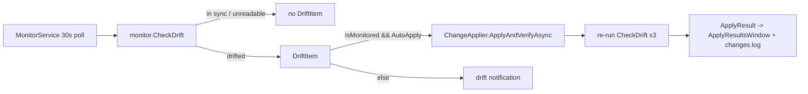
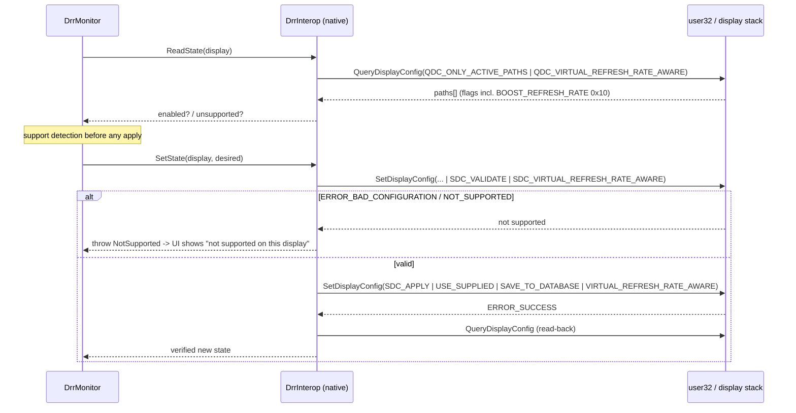
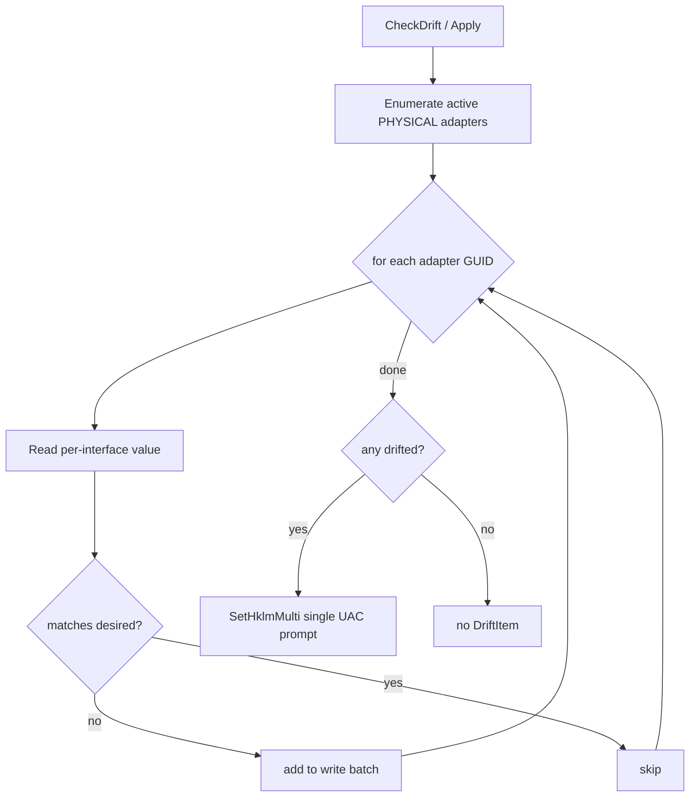

# feat: Add 12 Additional Monitored Settings (Privacy, Network, System)

## Summary

Add **12 new monitored settings** to GamerGuardian, each implementing the existing
`IMonitoredSetting` contract and surfacing through the existing **monitor / desired /
auto-apply** UI triple, polled on the current 30s loop, reversible, and verifiable via
`changes.log` + the Apply Results surface. No new *monitoring* model is introduced.

Two new tabs (**Privacy**, **Network**) are added per the confirmed IA decision; the rest
land on existing tabs. Eight settings are cookie-cutter registry/service monitors that
mirror `GameDvrMonitor` / `NetworkThrottlingMonitor` / `VrrMonitor` exactly. **Four break
the simple template** and carry dedicated work:

- **Dynamic Refresh Rate (DRR)** — confirmed feasible via the public `SetDisplayConfig`
  API with the `DISPLAYCONFIG_PATH_BOOST_REFRESH_RATE` path flag (user-mode, no
  elevation, distinct from VRR). Needs new native plumbing in the display-config layer.
- **Nagle's algorithm** — per-network-interface registry writes; needs active-interface
  enumeration.
- **NIC power management** — a device power-management property (`PnPCapabilities` under
  the adapter's class instance); read/write feasibility from user mode is spike-gated.
- **Visual effects → best performance** — partly stored in the binary
  `UserPreferencesMask`; needs bit-level read-back for accurate verify.

The work is additive and reuses the existing applier, logger, elevation, and Apply
Results surfaces. It must not regress the software-rendered-WPF / Mica-off working-set
wins and adds no new background thread (R20).

---

## Problem Frame

GamerGuardian's value is the **drift-guard**: keep a setting at the value the user chose
and re-assert it after Windows updates, driver installs, or other apps silently change it
(see origin: `docs/brainstorms/2026-06-05-additional-settings-requirements.md`). Three
gaps fit that model and are addressed here:

1. **Privacy/telemetry toggles Windows re-enables on feature updates** — Cross-Device
   Platform, Advertising ID, Activity History, Tailored experiences.
2. **Game Bar / Game DVR is only partially locked down** — the HKLM `AllowGameDVR` policy
   and related capture toggles re-enable after updates.
3. **Gaming categories the app doesn't touch** — network latency (Nagle, NIC power
   management), Dynamic Refresh Rate, and system toggles (Power Throttling, Fast Startup,
   Visual effects).

**Scope boundary at a glance:** no new monitoring *patterns* (list-based Defender
exclusions, scheduled-task disable, non-AI UWP removal are out) and no one-shot *actions*
(process kills, restore points, GPU driver-profile tweaks are out). A setting is a steady
*state*, not an *action*.

---

## Key Technical Decisions

- **KTD1 — Every setting reuses the existing contract and row model.** New toggles are
  `IMonitoredSetting` implementations registered in `App.xaml.cs` `fixedMonitors`
  (services extend `ServiceCatalog.All` instead), surfaced via `GlobalToggleRow`. Auto-save,
  `[ui ]` `changes.log` lines, Apply Results, and reboot handling come for free. *Rationale:*
  R1, R2; the `Monitors/CLAUDE.md` playbook is the authoritative recipe.

- **KTD2 — `DesiredOn = true` always means "gaming-optimized"; inverted-semantics rows
  use "Gaming/Default" labels.** Power Throttling, Nagle, NIC power management, Fast
  Startup, CDP, Activity History write a value that reads as "disabled in registry" but
  *enabled gaming behavior*, so they label "Gaming/Default" (mirroring
  `NetworkThrottlingMonitor`). Advertising ID, Tailored experiences, Visual effects, DRR
  use intuitive "Enabled/Disabled". *Rationale:* R6, existing convention.

- **KTD3 — DRR uses `SetDisplayConfig`, NOT `DisplayConfigSetDeviceInfo`.** The DRR toggle
  is `DISPLAYCONFIG_PATH_INFO.flags & DISPLAYCONFIG_PATH_BOOST_REFRESH_RATE (0x10)`,
  read via `QueryDisplayConfig` and written via `SetDisplayConfig` with
  `SDC_APPLY | SDC_USE_SUPPLIED_DISPLAY_CONFIG | SDC_SAVE_TO_DATABASE | SDC_VIRTUAL_REFRESH_RATE_AWARE`.
  No `DISPLAYCONFIG_DEVICE_INFO_TYPE` enum value maps to DRR. Support detection = call
  `SetDisplayConfig` with `SDC_VALIDATE` first; `ERROR_BAD_CONFIGURATION`/`ERROR_NOT_SUPPORTED`
  ⇒ "not supported on this display". User-mode, no elevation. *Rationale:* R17, AE4;
  confirmed by Microsoft docs (see Sources). This is the single most de-risked unknown
  from the origin doc.

- **KTD4 — DRR is monitored per-display with a per-display `SettingId` (`drr:<display>`).**
  It mirrors the **HDR** per-display model (`DisplayPreference.Hdr` → `DisplayRow`), **not**
  the global VRR toggle (`DisplayToggleRows`, which is bound to `GlobalPreferences`). The
  per-display `SettingId` is load-bearing, not cosmetic: `MonitorService` keys
  `_autoApplyBackoff` / `_lastVerified` / stickiness on `SettingId` *only* (not `DisplayKey`),
  so a shared `SettingId="drr"` across displays would conflate their backoff/verify state. A
  `drr:<display>` id keeps each display independent and matches the existing per-display id
  prefixes (`hdr:`, `refresh:`, `resolution:`) that `SettingDocs.Get` already dispatches —
  add a `drr:` case there. *Rationale:* call-out resolved to per-display for IA consistency;
  the per-display id avoids a `MonitorService` keying change.

- **KTD5 — Nagle and NIC power management assert across all active *physical* adapters,
  collapsed into one `DriftItem`.** "Drift" means any active physical adapter deviates from
  desired; apply writes all drifted adapters in one elevated batch to keep a single UAC
  prompt. Virtual/loopback adapters are excluded. Two accepted limitations of the single-item
  collapse: (a) **per-adapter drift attribution is sacrificed** — `MonitorService` keys
  stickiness/external-reset detection on the single `SettingId`, so one flapping adapter
  inflates the global counter; this is the accepted cost of batched elevation. (b) **mid-batch
  partial failure** — `SetHklmMulti` chains writes with `&&` in one `cmd.exe`, so a failure on
  adapter *k* leaves adapters `1..k-1` written and `k+1..n` untouched; `RawAfter` must report
  per-adapter status rather than a single collapsed string so the Apply Results don't lie.
  *Rationale:* call-out resolved to all-active-physical; per-NIC enumeration resolved at
  runtime (interface GUIDs are machine-local, never persisted).

- **KTD6 — Spike-gated items degrade to detect-only, never silent drop.** NIC power
  management and the Visual-effects mask each start with a feasibility spike (`Execution
  note`). If a clean read-back + reversal can't be proven, the setting ships **detect-only**.
  Detect-only is *not* "monitor with a no-op `Apply`" — that would re-read as still-drifted,
  log a `Verified=false` ApplyResult, and (if the user enabled auto-apply) re-fire on the
  existing 15-minute `MonitorService` backoff, showing a recurring *failure* for something
  that never attempted anything. Instead, a detect-only `DriftItem` **forces `AutoApply=false`
  at the source** (ignores the pref) and surfaces guidance rather than attempting a write, so
  it reports drift without ever entering the auto-apply/verify path. *Rationale:* R3 (a setting
  that can't be cleanly read back and reversed doesn't ship the full triple), call-out
  resolved; grounded in `ChangeApplier`/`MonitorService` verify+backoff behavior. Two
  review refinements: (a) **avoid notification spam** — a non-auto drifted item becomes a
  *notification* every 30s poll, so a detect-only item must present once / on demand rather
  than nagging each tick. (b) **detect-only still needs a reliable read** — if the spike
  fails because the value can't be *read* from user mode (not just written), detect-only has
  no signal either and the setting is omitted, not shipped detect-only. Detect-only is the
  floor only when the read works but the write/reversal doesn't.

- **KTD7 — Reversal is delete-the-value where Windows has no explicit registry default.**
  Reversal restores the Windows default by deleting the policy value rather than writing a
  guessed default, except where a concrete default exists (service start types, NIC
  `PnPCapabilities`). **Constraint discovered in deepening:** `ElevatedRegistry` today exposes
  only single-value `DeleteHklmValue` (one `reg.exe` invocation = one UAC prompt) and add-only
  `SetHklmMulti` — there is **no batched delete**. So multi-value/multi-interface *reversals*
  (e.g. deleting `TcpAckFrequency` + `TCPNoDelay` across N adapters) would fire `2N` UAC
  prompts. U13 adds a batched-delete path so reversal stays one prompt; U2/U9/U10 depend on it.
  *Rationale:* R3, origin Dependencies; grounded in `Services/ElevatedRegistry.cs`.

- **KTD8 — Each catalog/docs change regenerates `docs/SETTINGS-REFERENCE.md` within its own
  unit.** The `SettingsReferenceMd_MatchesCatalogOutput` sync test asserts byte-equality, so
  every unit that adds a `SettingDocsCatalog` entry regenerates and commits the reference in
  the same change. *Rationale:* R21, keeps every commit green.

- **KTD9 — Exact registry paths are candidate-only until verified on a live machine.** The
  origin doc explicitly defers paths to planning + live verification. Each unit lists a
  *candidate* path and an explicit verify-on-live step; the path is confirmed before the
  monitor is hardened. The fail-safe is **asymmetric**: a wrong *read* path returns null ⇒
  no drift ⇒ safe, but a wrong *write* path writes a bogus key while the (correct) read path
  still shows drift, producing a permanently-unverified apply with no signal that the *path*
  is the cause. Read and write paths must be the same verified path, and U-level manual
  integration is what catches a write-path error. *Rationale:* origin Dependencies/Assumptions.

- **KTD10 — Privacy and network settings use `privacy.` / `network.` id prefixes; system
  toggles stay flat.** `SettingsReferenceGen` buckets the generated reference doc purely by id
  prefix (`ai.`, `ai.app:`, `service:`, else "Global gaming + display"). Flat ids would dump
  CDP / Advertising ID / Activity History / Tailored experiences / Nagle / NIC power into the
  gaming-and-display section, mislabeled. Prefixing them (`privacy.cdp`, `network.nagle`, …)
  plus adding two buckets + ToC entries in `SettingsReferenceGen.Render()` and matching
  `SettingDocs.Get` prefix dispatch groups them sensibly and matches the new Privacy/Network
  tabs. Power Throttling, Fast Startup, Visual effects stay flat (they *are* gaming/system
  toggles). DRR uses `drr:<display>` (KTD4). **Ids bake into config keys, logging, and
  `SettingDocs` — this prefix decision is made before U1.** *Rationale:* keeps the generated
  artifact coherent; grounded in `Services/SettingsReferenceGen.cs`.

---

## High-Level Technical Design

### Setting classification matrix

Every setting still implements `IMonitoredSetting`; this matrix shows which read/write
template each follows and its surfacing. Registry paths are **candidates to verify on a
live machine** (KTD9).

| # | Setting | Id | Hive / surface | Template | Labels | Elevation | Reboot | Tab |
|---|---------|-----|----------------|----------|--------|-----------|--------|-----|
| 1 | Cross-Device Platform off | `privacy.cdp` | HKLM policy | std registry | Gaming/Default | UAC | no | Privacy |
| 2 | Advertising ID off | `privacy.advertisingid` | HKCU | std registry | Enabled/Disabled | direct | no | Privacy |
| 3 | Activity History off | `privacy.activityhistory` | HKLM policy | std registry (multi-value) | Gaming/Default | UAC | no | Privacy |
| 4 | Tailored experiences off | `privacy.tailoredexp` | HKCU | std registry | Enabled/Disabled | direct | no | Privacy |
| 5 | Game Bar / DVR full lockdown | `gamedvr` (extend) | HKLM policy + HKCU | multi-value | On/Off | UAC (batched) | no | Display/Capture card |
| 6 | Expanded service entries | `service:*` | SCM | catalog | n/a (radios) | service ctl | varies | Services |
| 7 | Power Throttling off | `powerthrottling` | HKLM | std registry (inverted) | Gaming/Default | UAC | no | CPU/Power |
| 8 | Fast Startup off | `faststartup` | HKLM | std registry (inverted) | Gaming/Default | UAC | **yes** | Global gaming |
| 9 | Visual effects → best perf | `visualfx` | HKCU + binary mask | binary read/modify | Enabled/Disabled | direct | no | Global gaming |
| 10 | Nagle's algorithm off | `network.nagle` | HKLM per-interface | per-NIC enumeration | Gaming/Default | UAC (batched) | no | Network |
| 11 | NIC power management off | `network.nicpower` | HKLM device class | per-adapter (spike) | Gaming/Default | UAC (batched) | **yes** | Network |
| 12 | Dynamic Refresh Rate | `drr:<display>` (per-display) | DisplayConfig API | display subsystem (HDR-style) | Enabled/Disabled | none | no | Display |

Eight of twelve (1–4, 7–9 + each service) are straightforward DWORD/registry monitors.
Four need dedicated logic: **DRR** (native API), **Nagle** (per-interface), **NIC power**
(device property, spike), **Visual effects** (binary mask).

### How a new toggle flows (unchanged pipeline — for reviewer orientation)



### DRR read / validate / write sequence (KTD3)



### Per-NIC apply (KTD5)



---

## Output Structure

New files (existing files are modified in place; see per-unit `Files`). Registry/service
monitors follow the flat `Monitors/` convention.

```
src/GamerGuardian/
  Monitors/
    CdpMonitor.cs                 # U1
    AdvertisingIdMonitor.cs       # U1
    ActivityHistoryMonitor.cs     # U1
    TailoredExperiencesMonitor.cs # U1
    PowerThrottlingMonitor.cs     # U4
    FastStartupMonitor.cs         # U5
    VisualEffectsMonitor.cs       # U6
    DrrMonitor.cs                 # U8
    NagleMonitor.cs               # U9
    NicPowerMonitor.cs            # U10
  Native/
    DrrInterop.cs                 # U7 (helper over DisplayConfig.cs additions)
    NetworkAdapters.cs            # U9 (active physical NIC enumeration)
```

---

## Implementation Units

> Units are grouped into four phases. **Phase 0** is foundational infrastructure (U13,
> runs first). **Phase A** is the safe, high-drift Tier A work; **Phase B** is the
> new-category / native-surface Tier C work; **Phase C** closes out human docs and the
> footprint regression check. U-IDs are stable and never renumbered.

### Phase 0 — Foundation (do first)

### U13. ElevatedRegistry batched-delete extension

> U-ID is 13 (assigned after deepening) but this unit runs **first** — U2, U9, and U10
> depend on it. Ordering and U-ID need not match (KTD stability rule).

**Goal:** Add a batched-delete path to `ElevatedRegistry` so multi-value / multi-interface
*reversals* stay a single UAC prompt, matching the existing batched-add (`SetHklmMulti`).

**Requirements:** R3, R5 (enables clean reversal for U2/U9/U10).

**Dependencies:** none.

**Files:**
- `src/GamerGuardian/Services/ElevatedRegistry.cs` (add `DeleteHklmMulti(IEnumerable<(subkey,name)>)`;
  add an allowlist input guard shared by the batched add + delete builders)
- `tests/GamerGuardian.Tests/` (assert the delete command builder produces a well-formed
  chained command for N pairs; assert the input guard **rejects** a crafted `&&` segment;
  mirror any existing `SetHklmMulti` formatting test)

**Approach:** Today `SetHklmMulti` emits `reg add ... && reg add ...` in one elevated
`cmd.exe` (add-only); `DeleteHklmValue` is single-value (one prompt each). Add a **separate
`DeleteHklmMulti(IEnumerable<(subkey,name)>)`** rather than overloading the add tuple — the
add tuple is `(subkey,name,kind,data)` and folding a delete into it forces an awkward
sentinel `kind`. Chain `reg delete ... /f` the same way.

**Input hardening (security):** the existing `SetHklmMulti` interpolates `subkey`/`name`
(and unquoted DWORD `data`) directly into the chained `cmd.exe` argument with no validation.
All current/planned callers pass GUID-shaped or static paths, so there is no live injection
today — but a future caller passing `&&`/`"`/`|` in any segment would execute arbitrary
commands inside the UAC-approved process. Add an allowlist guard to **both** the batched add
and the new batched delete (assert `subkey` matches `[\w\\{}.-]+`, `name` matches `[\w\s.-]+`,
no shell metacharacters) and a unit test that the builder rejects a crafted `&&` segment.

**Partial-failure posture:** `&&` chaining aborts the remainder on first failure, leaving a
partial state. Choose abort-and-report vs. non-aborting; apply the choice to both batches.
**Note:** `cmd.exe` returns only an aggregate exit code to the non-elevated parent, so honest
per-item/per-adapter status (KTD5b, U9/U10 `RawAfter`) cannot come from the return value — it
requires a **post-apply re-read** of each target. Budget that re-read in U9/U10.

**Patterns to follow:** existing `SetHklmMulti` / `DeleteHklmValue` in `ElevatedRegistry.cs`.

**Test scenarios:**
- If the command-string builder is reachable without spawning `reg.exe`: given N (subkey,name)
  pairs, the built batch is one chained command deleting all N with `/f`. Otherwise
  `Test expectation: none -- no test seam; behavior verified through U9/U2 manual integration.`
- Single-pair batch behaves identically to `DeleteHklmValue`.

**Verification:** Multi-interface Nagle reversal (U9) produces **one** UAC prompt, not 2N.
Grep `ElevatedRegistry.cs` to confirm the new method landed (native/elevation surface is a
high-value Grep target).

---

### Phase A — Tier A (safe, high-drift registry/service)

### U1. Privacy tab + four telemetry monitors

**Goal:** Add a new **Privacy** tab and four cookie-cutter monitors: Cross-Device Platform,
Advertising ID, Activity History, Tailored experiences.

**Requirements:** R1, R2, R3, R4, R5, R6, R8, R10, R11, R12, R22 (advances AE1).

**Dependencies:** none.

**Files:**
- `src/GamerGuardian/Monitors/CdpMonitor.cs` (new)
- `src/GamerGuardian/Monitors/AdvertisingIdMonitor.cs` (new)
- `src/GamerGuardian/Monitors/ActivityHistoryMonitor.cs` (new)
- `src/GamerGuardian/Monitors/TailoredExperiencesMonitor.cs` (new)
- `src/GamerGuardian/Models/AppConfig.cs` (add four `ToggleSettingPref` to `GlobalPreferences`)
- `src/GamerGuardian/App.xaml.cs` (register four monitors in `fixedMonitors`)
- `src/GamerGuardian/UI/SettingsWindow.xaml` (new `<TabItem Header="Privacy">` with an
  `ItemsControl` bound to a new `PrivacyTogglesList`, `ItemTemplate="{StaticResource GlobalToggleTemplate}"`).
  **Tab order:** General | Global gaming | **Privacy** | **Network** | Services | Windows AI |
  Display | CPU/Power | BIOS — Privacy and Network insert after Global gaming, before Services
  (per the confirmed IA).
- `src/GamerGuardian/UI/SettingsWindow.xaml.cs` (new `ObservableCollection<GlobalToggleRow> PrivacyToggleRows`,
  bind in ctor, populate in a new `LoadPrivacy()` with `SyncIfUnmonitored` + `GlobalToggleRows.Add`-style blocks)
- `src/GamerGuardian/Services/SettingDocsCatalog.cs` (4 `SettingDetails`, ≥2 scenarios each; ids `privacy.*`)
- `src/GamerGuardian/Services/SettingDocs.cs` (add a `privacy.` prefix case to **each of** `MechanismFor` / `ApplyCommandFor` / `VerifyCommandFor` — note `SettingDocs` has no `Get`; the per-id routing is split across these three methods, so a new prefix needs all three) + a `privacy.` case in `SettingDocsCatalog.Get`'s prefix dispatch
- `src/GamerGuardian/Services/SettingsReferenceGen.cs` (add **both** the **Privacy** (`privacy.`) and **Network** (`network.`) buckets + ToC entries here in U1, even though Network ids arrive in U9 — building both buckets up front avoids U9's `network.*` ids silently falling into the mislabeled "Global gaming + display" bucket if U9 lands first. **Regenerate `SETTINGS-REFERENCE.md` only after the bucket edit** so the byte-equal sync test doesn't lock in a mislabeled grouping — KTD10)
- `docs/SETTINGS-REFERENCE.md` (regenerate — KTD8)
- `tests/GamerGuardian.Tests/SettingDocsCatalogTests.cs`, `SettingDocsTests.cs` (add 4 ids to `[InlineData]`)

**Candidate registry paths (verify on live — KTD9):**
- CDP: `HKLM\SOFTWARE\Policies\Microsoft\Windows\System\EnableCdp` = `0` (off). Reversal: delete value.
- Advertising ID: `HKCU\Software\Microsoft\Windows\CurrentVersion\AdvertisingInfo\Enabled` = `0`. Reversal: set `1`.
- Activity History: `HKLM\SOFTWARE\Policies\Microsoft\Windows\System` → `EnableActivityFeed`/`PublishUserActivities`/`UploadUserActivities` = `0` (multi-value, one `SetHklmMulti` batch). Reversal: delete values.
- Tailored experiences: `HKCU\Software\Microsoft\Windows\CurrentVersion\Privacy\TailoredExperiencesWithDiagnosticDataEnabled` = `0`. Reversal: set `1`.

**Approach:** Each monitor mirrors `GameModeMonitor` (HKCU) or `NetworkThrottlingMonitor`
(HKLM via `ElevatedRegistry`). `static ReadCurrent()` returns `bool?` (null on absent =
not drift, per playbook). HKLM writes go through `ElevatedRegistry.SetHklmDword` /
`SetHklmMulti`; HKCU writes are direct. New `GlobalPreferences` props default
`Monitor=false` so existing users see zero behavior change until they opt in (mirrors the
Windows-AI defaults). `AppConfigCloner.CopyInto` copies `Global` wholesale via JSON
round-trip — **no cloner edits needed** for new `Global` toggles.

**Patterns to follow:** `src/GamerGuardian/Monitors/GameModeMonitor.cs`,
`NetworkThrottlingMonitor.cs`; UI tab scaffolding mirrors the existing Global-gaming
`ItemsControl` + `GlobalToggleTemplate` binding in `SettingsWindow.xaml(.cs)`.

**Test scenarios:**
- For each of the 4 ids: `SettingDocs.MechanismFor(id)` ≠ `"(unknown)"` and is non-empty; `VerifyCommandFor(id)` non-empty (extend `SettingDocsTests` `[InlineData]`).
- For each of the 4 ids: `SettingDocsCatalog.Get(id)` returns a populated entry with ≥2 scenarios (extend `SettingDocsCatalogTests.Get_KnownIds_ReturnsPopulatedEntry`).
- `SettingDocsCatalog.All` has no duplicate setting ids after the additions.
- `SettingsReferenceMd_MatchesCatalogOutput` passes after regeneration (byte-equal).
- Covers AE1. Manual/integration: with CDP monitored desired=off + auto-apply on, flip the value on, confirm the next poll re-asserts off and writes a `changes.log` before/after + verify command. (Live-registry read/apply is verified through the Apply Results surface, not a unit test — the monitors read the real registry.)

**Verification:** New Privacy tab renders 4 rows with Monitor / desired / Auto-apply /
Learn More; each reads back live state when unmonitored; `dotnet build` clean (warnings =
errors); `dotnet test` green. Grep each new monitor file + the `fixedMonitors` block to
confirm edits landed (Edit-silent-failure gotcha).

---

### U2. Game Bar / Game DVR full lockdown

**Goal:** Extend the existing `gamedvr` monitor to also assert the HKLM `AllowGameDVR`
policy and any related capture toggles, so the lockdown survives updates that re-enable
capture (single intent, not a duplicate card — R9).

**Requirements:** R9, R4, R5, R22 (advances AE2).

**Dependencies:** U13 (batched delete for the `AllowGameDVR` policy reversal at one prompt).

**Files:**
- `src/GamerGuardian/Monitors/GameDvrMonitor.cs` (extend `ReadCurrent`/`Apply`/`CheckDrift`)
- `src/GamerGuardian/Services/SettingDocs.cs` (update `gamedvr` mechanism/verify to include the policy)
- `src/GamerGuardian/Services/SettingDocsCatalog.cs` (refresh `gamedvr` copy: now also locks the HKLM policy)
- `docs/SETTINGS-REFERENCE.md` (regenerate)
- `tests/GamerGuardian.Tests/` (no new id; verify existing `gamedvr` coverage still passes)

**Candidate paths (verify on live — KTD9):** add `HKLM\SOFTWARE\Policies\Microsoft\Windows\GameDVR\AllowGameDVR` = `0`
to the existing HKCU `System\GameConfigStore\GameDVR_Enabled` + `...\GameDVR\AppCaptureEnabled` writes.

**Approach:** `CheckDrift` now considers drift if *either* the HKCU capture toggles *or*
the HKLM policy deviate. `Apply` writes the HKCU values directly **and** the HKLM policy via
`ElevatedRegistry.SetHklmMulti` so the user gets **one** UAC prompt for the whole lockdown.
`RawBefore`/`RawDesired` strings expand to list all three values. Keep `DesiredOn=false`
default (current behavior) — extending coverage must not flip any existing user's desired
value. Reversal of the policy uses the U13 batched delete (KTD7).

**Migration behavior (call out in the PR):** existing users who already monitor `gamedvr`
will, on the first poll after upgrade, see *new* drift from the `AllowGameDVR` policy they
didn't track before — triggering a one-time UAC prompt on a setting they thought was settled.
Confirm this is intended (it is the point of the lockdown extension); if undesired, gate the
new HKLM check behind a default-off sub-pref.

**Patterns to follow:** existing `GameDvrMonitor.cs`; multi-value HKLM batching as used by
the AI-policy monitors (`EdgeAiMonitor` etc.) via `SetHklmMulti`.

**Test scenarios:**
- `gamedvr` still passes `SettingDocsTests` / `SettingDocsCatalogTests` after the copy/mechanism update.
- `SettingsReferenceMd_MatchesCatalogOutput` passes after regeneration.
- `RawBefore`/`RawDesired` include the `AllowGameDVR` policy token (assert via a small string check if a testable seam exists; otherwise covered by the manual check below).
- Covers AE2. Manual/integration: with lockdown monitored, set `AllowGameDVR=1`, confirm the next poll re-asserts `0` and the Apply Results show all three values in before/after.

**Verification:** A single UAC prompt applies the full lockdown; Apply Results lists HKCU
toggles + HKLM policy; reversal deletes the policy value. Grep `GameDvrMonitor.cs` to
confirm the policy read/write landed.

---

### U3. Expanded Windows-service catalog entries

**Goal:** Add safe, well-understood service rows (e.g. SysMain/Superfetch recommendation,
common vendor updater services) to `ServiceCatalog.All`, monitored/applied through the
existing service monitor.

**Requirements:** R13, R21 (advances AE6).

**Dependencies:** none (catalog-driven; **no `App.xaml.cs` change** — KTD1).

**Files:**
- `src/GamerGuardian/Services/ServiceCatalog.cs` (add `ServiceDefinition` entries)
- `src/GamerGuardian/Services/SettingDocsCatalog.cs` (add a `SvcRec(...)` entry per new service, ≥2 scenarios)
- `docs/SETTINGS-REFERENCE.md` (regenerate)
- `tests/GamerGuardian.Tests/ServiceCatalogTests.cs` (extend `All_IncludesExpectedServices` `[InlineData]`; invariants)
- `tests/GamerGuardian.Tests/SettingDocsCatalogTests.cs`, `SettingDocsTests.cs` (add `service:<name>` ids)

**Approach:** Keep the set **conservative** — only entries broadly safe to set Manual/Disabled
(per `GamingOptimize-Guide.md` cautions). SysMain already exists with `RecommendedTarget: null`
(listed, not in preset); decide per Microsoft guidance whether to give it a recommendation
or leave opt-in. Vendor updaters get `RecommendedTarget: ServiceTargetState.Disabled` or
`null`. **Check each candidate for the policy-revert trap** (the `DoSvc` precedent): if
Windows reverts the Services-hive `Start` write, the service needs a `PolicyOverride`, not a
plain row. `PolicyOverride` is reserved for exactly those — a test asserts only `DoSvc` has
one today, so adding one means extending that test deliberately.

**Patterns to follow:** existing `ServiceCatalog.cs` entries; `SvcRec(...)` helper in
`SettingDocsCatalog.cs`; `ServiceCatalogTests` invariants.

**Test scenarios:**
- `ServiceCatalogTests`: no duplicate names; all required fields non-empty; `DefaultStartType` known; `RecommendedTarget != Default`; each new service appears in `All_IncludesExpectedServices`.
- `PolicyOverride_OnlyOnServicesThatNeedIt` still holds (only services that genuinely revert get one — extend deliberately if needed).
- Each new `service:<name>` id: `Get` returns populated entry (≥2 scenarios); `MechanismFor`/`VerifyCommandFor` non-empty.
- `SettingsReferenceMd_MatchesCatalogOutput` passes after regeneration.
- Covers AE6.

**Verification:** New services appear on the Services tab with Monitor / desired-start-type /
Auto-apply; `dotnet test` green; reference doc regenerated and committed.

---

### U4. Power Throttling off

**Goal:** Add a Power Throttling monitor (gaming-recommended off) surfaced on the CPU/Power
tab.

**Requirements:** R1–R6, R14, R22.

**Dependencies:** none.

**Files:**
- `src/GamerGuardian/Monitors/PowerThrottlingMonitor.cs` (new)
- `src/GamerGuardian/Models/AppConfig.cs` (`ToggleSettingPref PowerThrottling` in `GlobalPreferences`, `DesiredOn=true`)
- `src/GamerGuardian/App.xaml.cs` (register in `fixedMonitors`)
- `src/GamerGuardian/UI/SettingsWindow.xaml(.cs)` (CPU/Power tab — see Approach for placement)
- `src/GamerGuardian/Services/SettingDocsCatalog.cs` + `SettingDocs.cs` (id `powerthrottling`)
- `docs/SETTINGS-REFERENCE.md` (regenerate)
- `tests/GamerGuardian.Tests/` (add `powerthrottling` to docs `[InlineData]`)

**Candidate path (verify on live — KTD9):** `HKLM\SYSTEM\CurrentControlSet\Control\Power\PowerThrottling\PowerThrottlingOff`
= `1` (off = gaming). Inverted semantics → "Gaming/Default" labels. This is a **registry**
setting, *not* a powrprof/scheme operation despite the name. Reversal: delete value (KTD7).

**Approach:** Monitor mirrors `NetworkThrottlingMonitor` exactly (inverted HKLM DWORD via
`ElevatedRegistry.SetHklmDword`). For placement: the CPU/Power tab has **no toggle-row
`ItemsControl`** (only hand-built `ui:Card` blocks). **Prefer a hand-built card** mirroring the
existing Power plan card (`SettingsWindow.xaml` ~lines 550–585: a two-column `Grid` with
description + `Monitor` / `Want` / `Auto-apply` controls wired to `_Changed` handlers) — this is
the *lower-friction* path, since adding a one-row `ItemsControl`/`ObservableCollection` to serve
a single setting (Fast Startup is on Global gaming, U5) is more scaffolding for no reuse.

**Patterns to follow:** `NetworkThrottlingMonitor.cs` (inverted labels + elevated apply); the
Power plan card in the CPU/Power `TabItem` of `SettingsWindow.xaml` (~lines 550–585) +
its `*_Changed` handlers.

**Test scenarios:**
- `powerthrottling`: `MechanismFor` ≠ `"(unknown)"`, `VerifyCommandFor` non-empty, `Get` returns ≥2 scenarios.
- `SettingsReferenceMd_MatchesCatalogOutput` passes after regeneration.
- Manual/integration: monitored desired=Gaming (off), flip `PowerThrottlingOff=0`, confirm poll re-asserts `1` with logged before/after.

**Verification:** Row renders on CPU/Power with "Gaming/Default"; elevated apply produces one
UAC prompt; reference doc regenerated. Grep monitor + `fixedMonitors` to confirm registration.

---

### U5. Fast Startup off

**Goal:** Add a Fast Startup (hybrid boot) monitor, gaming-recommended off, reboot-required,
on the Global gaming tab.

**Requirements:** R1–R7, R18, R22.

**Dependencies:** none.

**Files:**
- `src/GamerGuardian/Monitors/FastStartupMonitor.cs` (new)
- `src/GamerGuardian/Models/AppConfig.cs` (`ToggleSettingPref FastStartup`, `DesiredOn=true`)
- `src/GamerGuardian/App.xaml.cs` (register)
- `src/GamerGuardian/UI/SettingsWindow.xaml.cs` (`LoadGlobals()` — add `SyncIfUnmonitored` + `GlobalToggleRows.Add`)
- `src/GamerGuardian/Services/SettingDocsCatalog.cs` + `SettingDocs.cs` (id `faststartup`)
- `docs/SETTINGS-REFERENCE.md` (regenerate)
- `tests/GamerGuardian.Tests/` (add `faststartup`)

**Candidate path (verify on live — KTD9):** `HKLM\SYSTEM\CurrentControlSet\Control\Session Manager\Power\HiberbootEnabled`
= `0` (off = gaming). Inverted → "Gaming/Default". Reversal: set `1` (concrete Windows
default exists). Set `RequiresReboot: true` on the `DriftItem` (R7).

**Approach:** Mirror `NetworkThrottlingMonitor` + `UsbSelectiveSuspendMonitor` (the latter
for the `RequiresReboot: true` pattern). Manual apply pops the reboot MessageBox; auto-apply
pops `RebootPendingWindow` — both come for free from the reboot-required plumbing.

**Patterns to follow:** `UsbSelectiveSuspendMonitor.cs` (reboot-required inverted HKLM).

**Test scenarios:**
- `faststartup`: docs coverage (mechanism non-`"(unknown)"`, verify non-empty, ≥2 scenarios).
- `SettingsReferenceMd_MatchesCatalogOutput` passes.
- Manual/integration: monitored desired=Gaming, `HiberbootEnabled=1`, confirm poll drift → apply re-asserts `0` and surfaces the reboot notice.

**Verification:** Row on Global gaming with "Gaming/Default"; reboot notice fires on apply.
Grep to confirm registration + `RequiresReboot`.

---

### U6. Visual effects → best performance (binary mask)

**Goal:** Add a Visual-effects monitor that asserts the "adjust for best performance"
profile and reads back the binary `UserPreferencesMask` correctly so verify is accurate
(AE5).

**Requirements:** R1–R6, R19, R22 (advances AE5).

**Dependencies:** none.

**Execution note:** Spike-first — confirm the exact `VisualFXSetting` value and the
`UserPreferencesMask` byte layout on a live machine before hardening. If the mask can't be
read back reliably, ship detect-only (KTD6).

**Files:**
- `src/GamerGuardian/Monitors/VisualEffectsMonitor.cs` (new; pure `static bool IsBestPerformance(int? visualFxSetting, byte[]? mask)` helper for unit testing)
- `src/GamerGuardian/Models/AppConfig.cs` (`ToggleSettingPref VisualFx`, `DesiredOn=true`)
- `src/GamerGuardian/App.xaml.cs` (register)
- `src/GamerGuardian/UI/SettingsWindow.xaml.cs` (`LoadGlobals()` add row)
- `src/GamerGuardian/Services/SettingDocsCatalog.cs` + `SettingDocs.cs` (id `visualfx`)
- `docs/SETTINGS-REFERENCE.md` (regenerate)
- `tests/GamerGuardian.Tests/VisualEffectsMaskTests.cs` (new — bit-level parsing)
- `tests/GamerGuardian.Tests/` (add `visualfx` to docs `[InlineData]`)

**Candidate paths (verify on live — KTD9):**
- Primary signal: `HKCU\Software\Microsoft\Windows\CurrentVersion\Explorer\VisualEffects\VisualFXSetting` = `2` (best performance).
- Verify accuracy: `HKCU\Control Panel\Desktop\UserPreferencesMask` (REG_BINARY) — parse the relevant bits so the after-verify reflects the real applied state. Reversal: restore `VisualFXSetting=1` (best appearance) or `0`/`3` (let Windows / custom) — decide the reversal target in the spike.

**Approach:** Factor the binary-mask interpretation into a **pure static helper** taking a
`byte[]` so it's unit-testable without the registry. The `Apply` lambda **verifies its own
post-condition** (re-reads and parses the mask, throws on mismatch) because there's no separate
verifier for binary state. **Scope clarification (deepening):** verify confirms the *persisted
registry/mask state*, **not** live-session behavior — `VisualFXSetting=2` + mask bits can be
written without the running session reflecting them until a `SystemParametersInfoW`
(`SPI_SETUIEFFECTS`…) broadcast or sign-out. That's acceptable for a drift-guard (it guards the
persisted value), but decide in the spike whether a `SystemParametersInfo` broadcast is in
scope; if not, say so in Learn More so "applied" isn't over-promised. Direct HKCU write (no
elevation).

**Patterns to follow:** `GameDvrMonitor.cs` (HKCU read/write); for the pure-helper test shape,
mirror the established repo precedents `PowerPlanMonitor.ResolveInstalledScheme` /
`CpuPlanBuilder.Decide` / `CpuDetector.Parse` (pure function over an injected fixture — already
the dominant per-monitor test pattern here).

**Test scenarios:**
- `IsBestPerformance` returns true for a known "best performance" mask byte array + `VisualFXSetting=2`; false for a "best appearance" sample; false for a custom/partial sample. (Covers AE5 at the unit level.)
- Handles `null` mask and `null` VisualFXSetting (absent → not drift).
- `visualfx` docs coverage (mechanism, verify, ≥2 scenarios).
- `SettingsReferenceMd_MatchesCatalogOutput` passes.
- Covers AE5. Manual/integration: apply best-performance, re-read, confirm after-verify reflects the real mask state.

**Verification:** Row on Global gaming; verify accurately reflects the binary mask (not just
`VisualFXSetting`); mask unit tests green.

---

### Phase B — Tier C (new categories / native surfaces)

### U7. DisplayConfig native DRR plumbing

**Goal:** Add the native surface for DRR to `Native/DisplayConfig.cs` and a `DrrInterop`
helper: `SetDisplayConfig` P/Invoke, the `SDC_*` and `DISPLAYCONFIG_PATH_BOOST_REFRESH_RATE`
constants, and `QDC_VIRTUAL_REFRESH_RATE_AWARE`. No user-facing behavior yet — this is the
foundation for U8.

**Requirements:** R17 (foundation; AE4).

**Dependencies:** none (pure native additions).

**Files:**
- `src/GamerGuardian/Native/DisplayConfig.cs` (add `SetDisplayConfig` `[DllImport]`; constants `SDC_APPLY=0x80`, `SDC_USE_SUPPLIED_DISPLAY_CONFIG=0x20`, `SDC_SAVE_TO_DATABASE=0x200`, `SDC_VALIDATE=0x40`, `SDC_VIRTUAL_REFRESH_RATE_AWARE=0x20000`, `QDC_VIRTUAL_REFRESH_RATE_AWARE`, `DISPLAYCONFIG_PATH_BOOST_REFRESH_RATE=0x10`)
- `src/GamerGuardian/Native/DrrInterop.cs` (new — `ReadState(DisplayInfo)`, `IsSupported(...)`, `SetState(...)`, plus a pure `static bool IsDrrEnabled(uint pathFlags)`)

**Approach:** `QueryDisplayConfig` already exists; reuse its buffer pattern with the
`QDC_VIRTUAL_REFRESH_RATE_AWARE` flag added. `IsDrrEnabled(flags)` = `(flags & 0x10) != 0` —
pure, unit-testable. `SetState` clears/sets `0x10` on the matching path
(`DISPLAYCONFIG_PATH_INFO.flags`), calls `SetDisplayConfig` with `SDC_VALIDATE | ...AWARE`
first (support detection), then `SDC_APPLY | USE_SUPPLIED | SAVE_TO_DATABASE | ...AWARE`,
then read-back. Match the existing display by `AdapterId`/`TargetId` from
`DisplayHelper.EnumerateActiveDisplays()`. No elevation.

**Patterns to follow:** the existing advanced-color get/set wiring in `DisplayConfig.cs`
(struct + header pattern), `DisplayHelper.cs` enumeration; for the `IsDrrEnabled` pure-helper
test, mirror `PowerPlanMonitorTests` / `CpuDetectorTests` (pure function over a fixture).

**Test scenarios:**
- `IsDrrEnabled(0x10)` true; `IsDrrEnabled(0x0)` false; ignores unrelated flag bits (e.g. `0x08`).
- `Test expectation: none` for the raw `[DllImport]` declarations (no behavior) — covered by U8's integration.

**Verification:** `dotnet build` clean (P/Invoke signatures compile); `IsDrrEnabled` unit test
green. Grep `DisplayConfig.cs` to confirm the new constants + `SetDisplayConfig` import landed
(native-signature edits are a high-value Grep target).

---

### U8. DRR monitor (per-display, Display tab, graceful unsupported)

**Goal:** Add the per-display DRR monitor on the Display tab, with clean
"not supported on this display" handling (AE4).

**Requirements:** R1–R6, R17, R22 (advances AE4).

**Dependencies:** U7.

**Files (mirror HDR's per-display wiring — NOT the global VRR `DisplayToggleRows`):**
- `src/GamerGuardian/Monitors/DrrMonitor.cs` (new; per-display, `SettingId: $"drr:{key}"`, `DisplayKey:"display"`)
- `src/GamerGuardian/Models/AppConfig.cs` (add `DrrPref Drr` to **`DisplayPreference`** (~line 43), mirroring the nested `Hdr` (`HdrPref`); `Monitor=false` default)
- `src/GamerGuardian/App.xaml.cs` (register)
- `src/GamerGuardian/UI/SettingsWindow.xaml.cs` — `DisplayRow` class: add `DrrMonitor` / `DrrDesiredOn` / `DrrAutoApply` properties (mirror the existing HDR properties ~lines 1581–1583) **and a net-new `DrrSupported` property** to drive the unsupported state; `LoadDisplays()` (~lines 575–608): read live DRR state + support per display (mirror the per-display HDR read ~line 582)
- `src/GamerGuardian/UI/SettingsWindow.xaml` — per-display `DataTemplate` (~lines 468–504): add a DRR block mirroring the HDR block (~lines 478–481), **plus visibility triggers** that show a "Not supported on this display" label instead of the toggle when `DrrSupported` is false
- `src/GamerGuardian/Services/SettingDocsCatalog.cs` + `SettingDocs.cs` (id prefix `drr:`; add a `drr:` case to `SettingDocsCatalog.Get` and to each of the three `SettingDocs` methods — mechanism = the DisplayConfig API, verify = a `QueryDisplayConfig`-based check / UI pointer since there's no `Get-ItemProperty`)
- `docs/SETTINGS-REFERENCE.md` (regenerate)
- `tests/GamerGuardian.Tests/` (add a `drr:` id to docs `[InlineData]`)

**Approach:** Source state from `DrrInterop` (U7) per display (KTD3, KTD4) — **not** from a
registry value, and **not** via the global `DisplayToggleRows` (which is bound to
`GlobalPreferences` and has no per-display key; that list holds VRR). The per-display wiring
mirrors **HDR** end-to-end: nested `DisplayPreference.Drr` pref, `DisplayRow` properties,
`LoadDisplays()` live read, and a per-display template block. `CheckDrift` yields nothing when
DRR is unsupported on a display (not drift). **Net-new vs. HDR:** `DisplayRow` has no existing
"supported" concept, so `DrrSupported` + its template triggers are new UI plumbing (the
riskiest-to-undercount part of this unit — AE4 depends on it). **Unsupported-state UX (specify,
don't leave to the implementer):** when `DrrSupported` is false, the per-display DRR section
shows a single muted "Not supported on this display" label and **hides** the desired-value
toggle, the Monitor checkbox, and the Auto-apply control (there is nothing to monitor or
apply). When supported, all three render normally. This is the same control-suppression shape
the detect-only settings use (U6/U10) — keep them visually consistent. **Verify is flag-read-back only**
(`DISPLAYCONFIG_PATH_BOOST_REFRESH_RATE` bit), not a guarantee DRR is behaviorally active — the
same honest limitation as VRR (and the observed 24H2 driver regression); Learn More must not
over-promise.

**Patterns to follow:** **HDR** per-display handling in `SettingsWindow` (`DisplayRow` +
`DisplayPreference.Hdr` + `LoadDisplays` + the per-display `DataTemplate`) — this is the
correct template, not `VrrMonitor`/`DisplayToggleRows`. `VrrMonitor.cs` is only a reference for
the `CheckDrift` drift-vs-insync shape.

**Test scenarios:**
- `drr` docs coverage: `MechanismFor("drr")` non-`"(unknown)"`, `VerifyCommandFor("drr")` non-empty, `Get` returns ≥2 scenarios.
- `SettingsReferenceMd_MatchesCatalogOutput` passes.
- Covers AE4. Manual/integration on a DRR-capable laptop: toggle DRR, confirm read-back reflects the change; on an unsupported display, confirm the "not supported" state shows and no apply is offered.

**Verification:** DRR row appears per display on the Display tab; supported displays toggle
and verify via read-back; unsupported displays show the graceful state. Grep `DrrMonitor.cs`
+ registration.

---

### U9. Network tab + Nagle's algorithm (per-interface)

**Goal:** Add a new **Network** tab and the Nagle's-algorithm monitor, asserting the
no-delay / ack-frequency values across all active physical interfaces at full
monitor/desired/auto-apply parity, with honest contested-benefit Learn More copy.

**Requirements:** R1–R6, R15, R22 (advances AE3, F4).

**Dependencies:** U13 (batched delete for per-interface reversal at one prompt). (NIC
enumeration helper is introduced here; U10 reuses it.)

**Files:**
- `src/GamerGuardian/Native/NetworkAdapters.cs` (new — enumerate active **physical** adapters → interface GUIDs via **IP Helper `GetAdaptersAddresses`** (not WMI — see Approach/F7); a pure filter helper (`IsActivePhysical(...)`) over the raw list is unit-testable)
- `src/GamerGuardian/Monitors/NagleMonitor.cs` (new; id `network.nagle`)
- `src/GamerGuardian/Models/AppConfig.cs` (`ToggleSettingPref Nagle`, `DesiredOn=true`, `Monitor=false`)
- `src/GamerGuardian/App.xaml.cs` (register)
- `src/GamerGuardian/UI/SettingsWindow.xaml` (new `<TabItem Header="Network">` + `ItemsControl` bound to `NetworkTogglesList`)
- `src/GamerGuardian/UI/SettingsWindow.xaml.cs` (new `ObservableCollection<GlobalToggleRow> NetworkToggleRows`, bind, `LoadNetwork()`)
- `src/GamerGuardian/Services/SettingDocsCatalog.cs` + `SettingDocs.cs` (id `network.nagle`; add a `network.` prefix case to `SettingDocsCatalog.Get` and to each of the three `SettingDocs` methods; Learn More states the contested, per-hardware nature and reversal — see U9 Learn-More minimum-claims note below)
- `src/GamerGuardian/Services/SettingsReferenceGen.cs` (add a **Network** bucket + ToC entry for the `network.` prefix — KTD10; if U1 already added the prefix-bucket scaffolding, this is just the Network entry)
- `docs/SETTINGS-REFERENCE.md` (regenerate)
- `tests/GamerGuardian.Tests/` (add `network.nagle`; NIC active-physical filter tests)

**Candidate paths (verify on live — KTD9):** `HKLM\SYSTEM\CurrentControlSet\Services\Tcpip\Parameters\Interfaces\{GUID}`
→ `TcpAckFrequency=1`, `TCPNoDelay=1` (per interface). Reversal: delete values (Windows
default = Nagle on). Use `SetHklmMulti` to batch all interfaces + values into **one** UAC
prompt (KTD5). Resolve interface GUIDs at runtime; never persist them (machine-local).

**Approach:** `CheckDrift` enumerates active physical adapters, reads each interface's values,
and yields a single combined drift item if **any** active physical adapter deviates (KTD5);
`RawBefore`/`RawAfter` report **per-adapter** status (not one collapsed string) so partial
results are honest. `Apply` writes all drifted interfaces in one `SetHklmMulti` batch; reversal
uses U13's batched delete. **Partial-failure posture (F3):** `&&` chaining aborts on first
failure, leaving a partial multi-adapter state that the verify pass will see as residual drift
— state the chosen posture (abort-and-report vs. non-aborting) per U13's decision.

**Empty-adapter edge case:** if the active-physical set is empty (Wi-Fi-only with Ethernet
disabled, mid-undock, VPN-only), `CheckDrift` yields **no** `DriftItem` — "no adapters" is not
drift (mirrors the null-on-absence rule). Do not synthesize phantom drift that can never clear.

**Per-tick cost (F7, R20):** use IP Helper `GetAdaptersAddresses` rather than WMI for
enumeration — WMI can cost 100s of ms and allocates heavily, and this runs every 30s. **Share
one enumeration per tick** across both NIC monitors via a short time-boxed static cache in
`NetworkAdapters` (e.g. valid for a few seconds). **Do NOT subscribe to a network-change event
for cross-tick invalidation** — a persistent event registration is functionally a new
always-running listener and would violate R20; a time-boxed cache stays within the existing
30s poll. Note the apply path amplifies this: `ChangeApplier` re-runs every monitor's
`CheckDrift` up to 3× per apply (200 ms apart) to verify, so one network-tweak apply triggers
up to 6 extra enumerations (3 retries × 2 NIC monitors) — the same time-boxed cache must cover
the verify window, and U12 should measure the apply+verify path, not just the idle poll.

Inverted-style "Gaming/Default" labels. Network tab scaffolding mirrors the Privacy tab from
U1, and the **Network** tab sits immediately after **Privacy** in the tab strip (see U1 tab
order).

**Learn-More minimum claims (R22, AE3, F4):** the Nagle (and NIC-power, U10) Learn More copy
must, at minimum: (a) state the benefit is contested and varies per hardware, (b) note it can
make some connections *worse* (call out Wi-Fi/latency-sensitive adapters specifically), and
(c) give the exact reversal. The test scenario asserts (a) is present; the copy should not be
left to implementer invention beyond these required claims.

**Patterns to follow:** `NetworkThrottlingMonitor.cs` (elevated + inverted labels);
`SetHklmMulti` batching; U1's tab scaffolding; `PowerPlanMonitor.ResolveInstalledScheme`
(delegate-injection over a real enumeration) as the template for a testable active-physical
filter.

**Test scenarios:**
- NIC enumeration: given a synthetic adapter list, the helper returns only active physical adapters (excludes loopback/virtual) — covered by factoring the filter into a pure function over a test fixture.
- `nagle` docs coverage (mechanism, verify, ≥2 scenarios) and Learn More copy contains the contested-benefit statement.
- `SettingsReferenceMd_MatchesCatalogOutput` passes.
- Covers AE3, F4. Manual/integration: enable Nagle-off, confirm all active physical interfaces get the values in one UAC prompt and Apply Results lists them.

**Verification:** Network tab renders the Nagle row at full parity; one UAC prompt covers all
interfaces; Learn More is honest about per-hardware risk. Grep `NagleMonitor.cs` +
`NetworkAdapters.cs` + registration.

---

### U10. NIC power management off (device property, spike-gated)

**Goal:** Add the NIC power-management monitor — assert "do not allow the computer to turn
off this device to save power" on active physical adapters — at full parity, on the Network
tab.

**Requirements:** R1–R6, R16, R22 (advances F4).

**Dependencies:** U9 (reuses `NetworkAdapters` enumeration + Network tab), U13 (batched delete
for reversal).

**Execution note:** Spike-first — confirm from user mode whether the device
power-management property is read/writable via the registry `PnPCapabilities` value under the
adapter's class instance, and whether the change needs an adapter restart/reboot to take
effect. If it can't be cleanly read back + reversed from user mode, ship **detect-only**
(reports drift, no auto-apply) with honest copy (KTD6).

**Files:**
- `src/GamerGuardian/Monitors/NicPowerMonitor.cs` (new; id `network.nicpower`)
- `src/GamerGuardian/Models/AppConfig.cs` (`ToggleSettingPref NicPower`, `DesiredOn=true`, `Monitor=false`)
- `src/GamerGuardian/App.xaml.cs` (register)
- `src/GamerGuardian/UI/SettingsWindow.xaml.cs` (`LoadNetwork()` add row)
- `src/GamerGuardian/Services/SettingDocsCatalog.cs` + `SettingDocs.cs` (id `network.nicpower`)
- `docs/SETTINGS-REFERENCE.md` (regenerate)
- `tests/GamerGuardian.Tests/` (add `network.nicpower`)

**Candidate path (verify on live — KTD9):** `HKLM\SYSTEM\CurrentControlSet\Control\Class\{4d36e972-e325-11ce-bfc1-08002be10318}\{NNNN}\PnPCapabilities`
= `24` (`0x18`, disables "allow the computer to turn off this device"). Per adapter instance;
map active physical adapters → their class-instance subkeys. Reversal: restore the prior
value (capture before-state) or delete to restore the driver default — decide in the spike.
Likely `RequiresReboot: true` (or adapter disable/enable) for the change to take effect.

**Approach:** Resolve each active physical adapter (from U9's **shared** enumeration — do not
re-enumerate, F7) to its class-instance subkey, read/write `PnPCapabilities` via
`ElevatedRegistry` (batched for one UAC prompt). If the spike shows the mapping or write is
unreliable from user mode, the monitor becomes **detect-only per KTD6**: the `DriftItem` forces
`AutoApply=false` (ignores the pref) and surfaces guidance instead of attempting a write — it
must **not** be a monitor-with-no-op-`Apply`, which would log a recurring `Verified=false`
failure on the 15-min backoff. **Reversal is algorithmic, not stored:** clear the `0x18` bits
from whatever the adapter's current `PnPCapabilities` is to restore the driver default — this
avoids persisting machine-specific before-values in `config.json` that go stale on adapter
replacement (the value's default is not a fixed constant across drivers). Set `RequiresReboot`
per spike finding (the property typically needs an adapter reset/reboot to take effect).

**Patterns to follow:** `NetworkThrottlingMonitor.cs` (elevated apply); U9 `NetworkAdapters`
enumeration; `UsbSelectiveSuspendMonitor.cs` (reboot-required) if reboot is needed.

**Test scenarios:**
- Adapter → class-instance subkey mapping returns the expected subkey for a synthetic fixture (pure function).
- `nicpower` docs coverage (mechanism, verify, ≥2 scenarios) including the contested-benefit + reversal statement.
- `SettingsReferenceMd_MatchesCatalogOutput` passes.
- Covers F4. Manual/integration on a machine with a physical NIC: apply, confirm `PnPCapabilities` set and read-back accurate; confirm reboot/adapter-reset behavior matches the `RequiresReboot` flag. If detect-only, confirm drift is reported and no auto-apply is offered.

**Verification:** NIC power row on the Network tab at parity (or detect-only with honest copy
if the spike fails); read-back accurate. Grep `NicPowerMonitor.cs` + registration.

---

### Phase C — Docs & footprint

### U11. Human docs, wiki, and SETTINGS-REFERENCE finalization

**Goal:** Update committed human docs and the wiki for the new settings and the two new tabs;
confirm `docs/SETTINGS-REFERENCE.md` is the final regenerated artifact.

**Requirements:** R22, R21.

**Dependencies:** U1–U10 (all catalog entries exist).

**Files:**
- `docs/` (narrative docs referencing the new settings + Privacy/Network tabs; e.g. README/feature docs and any tab overview)
- `docs/SETTINGS-REFERENCE.md` (final regeneration — confirm byte-equal to catalog output)
- `tools/sync-wiki.ps1` workflow output / wiki pages (per `tools/sync-wiki.ps1`, PS-5.1-compatible)
- `docs/screenshots/` (new Privacy + Network tab screenshots if screenshots are part of the docs set)

**Approach:** Each prior unit already regenerated `SETTINGS-REFERENCE.md`; this unit confirms
the final state and updates the human-facing narrative + wiki + screenshots. No code change.

**Test scenarios:** `Test expectation: none` — documentation only. The
`SettingsReferenceMd_MatchesCatalogOutput` gate (already green from prior units) is the
executable guard.

**Verification:** Docs and wiki mention all 12 settings + both new tabs; `dotnet test` green
(reference sync); screenshots refreshed.

---

### U12. Footprint & no-new-thread regression check

**Goal:** Confirm the additions don't regress the software-rendered-WPF / Mica-off working-set
wins and add no new always-running background thread (R20).

**Requirements:** R20.

**Dependencies:** U1–U10.

**Files:** none (verification unit).

**Approach:** Confirm all new monitors run on the existing 30s poll (no new timer/thread) and
that the two new tabs reuse `GlobalToggleRow` + the existing `Window.OnClosed` visual-tree
release (so they inherit disposal hygiene). Measure idle working set at 5 min across 3 runs
before/after, expecting ≤~3 MB mean delta (mirroring the CPU-plan footprint acceptance
procedure). **Also measure per-tick latency/allocation (F7):** the new monitors add NIC
enumeration and `QueryDisplayConfig` to every poll — heavier than the existing registry opens.
Confirm NIC enumeration is shared across the two NIC monitors (and ideally cached across ticks
with change-event invalidation) and that one poll's added wall-time/allocation is negligible.
Working set alone won't catch a per-tick allocation regression that fights LOH compaction.

**Test scenarios:** `Test expectation: none` — this is a runtime footprint/latency check, not a
unit test. Record the measured WS delta **and** per-tick latency/allocation delta in the PR.

**Verification:** No new always-running listener introduced — grep for new
`Timer`/`Thread`/`Task.Run` loops **and** event registrations (`NetworkChange.`,
`NotifyIpInterfaceChange`, `+=` on system events) outside the existing poll; idle WS within
tolerance; per-tick and apply+verify latency/allocation negligible; Mica-off / software-render
settings untouched.

---

## Scope Boundaries

### In scope
All 12 settings at full monitor/desired/auto-apply parity (NIC power + Visual effects may
degrade to detect-only per KTD6), two new tabs (Privacy, Network), the settled placements,
extension of the existing Game DVR lockdown, conservative service-catalog additions, native
DRR plumbing, tests, and docs.

### Deferred to Follow-Up Work
- Capturing the per-NIC enumeration, DRR/DisplayConfig, and `UserPreferencesMask` findings as
  the repo's first `docs/solutions/` learnings (via `/ce-compound`) once this lands — the
  CPU-plan work already flagged this gap.
- An advisory/monitor-only UX variant for contested tweaks (the user chose full parity for the
  network items — origin "Deferred for later").

### Outside this product's identity (not built here — carried from origin)
- New *monitoring patterns*: Defender exclusions (list-based), scheduled-task disable (NVIDIA
  overlay etc.), non-AI UWP removal (Phone Link etc.). Each needs a new pattern.
- One-shot *actions*: process kills, system restore points, GPU driver-profile tweaks
  (NVIDIA/AMD control-panel/nvapi). Not steady states; a future "Tools" panel is a different
  product surface.
- Windows 10 support — repo-wide scope-out.

---

## Risks & Mitigations

- **Registry paths wrong / SKU-specific (KTD9).** *Mitigation:* every path is candidate-only
  with an explicit verify-on-live step before hardening; `ReadCurrent` returns null on absence
  (not drift), so a wrong path fails safe (no spurious drift) rather than mis-applying.
- **NIC power management not cleanly read/writable from user mode.** *Mitigation:* spike-first;
  detect-only fallback (KTD6) rather than shipping a broken apply.
- **DRR driver/OS variability (24H2 regression observed).** *Mitigation:* `SDC_VALIDATE`
  support detection + "not supported on this display" state (AE4); never error or no-op-toggle.
- **Network tweaks make some connections worse (accepted liability).** *Mitigation:* honest
  Learn More copy + accurate read-back; full parity is the explicit user choice, not a default-on.
- **Per-commit doc-sync test breakage.** *Mitigation:* KTD8 — each catalog-touching unit
  regenerates `SETTINGS-REFERENCE.md` in the same change.
- **Edit tool silent no-op on critical blocks.** *Mitigation:* Grep after every edit to a
  monitor `Apply`/`ReadCurrent`, native P/Invoke signature, constant, or the `fixedMonitors`
  registration (documented repo gotcha).
- **Working-set regression (R20).** *Mitigation:* U12 footprint check; reuse `GlobalToggleRow`
  + existing 30s poll; no new thread.
- **Per-tick cost regression (NIC enum / `QueryDisplayConfig` every 30s).** *Mitigation:* IP
  Helper over WMI; share one NIC enumeration across both NIC monitors per tick; measure
  per-tick latency/allocation in U12, not just working set (F7).
- **No batched delete in `ElevatedRegistry` ⇒ multi-value reversal = many UAC prompts.**
  *Mitigation:* U13 adds a batched-delete path before U2/U9/U10 consume it.
- **Mid-batch partial failure leaves mixed multi-adapter state.** *Mitigation:* U13 fixes the
  chaining/partial-failure posture; U9/U10 report per-adapter status in `RawAfter` so Apply
  Results don't misrepresent a partial write.
- **DRR verify confirms the flag bit, not behavior (24H2 driver regression observed).**
  *Mitigation:* `SDC_VALIDATE` support gate + "not supported" state (AE4); Learn More states
  verify is flag-read-back only.
- **`MonitorService` reboot/backoff bookkeeping indexes results positionally.** The existing
  tick loop pairs `auto[i]` against `allResults[i]`, but `allResults` is corrective-batch +
  initial-batch concatenated (not `auto` order), and the loop truncates when result count ≠
  auto count. With only USB-selective-suspend reboot-required today this is rarely hit; U5
  (Fast Startup) and U10 (NIC power) add two more reboot-required monitors plus a
  variable-count collapsed NIC item, making misattributed reboot prompts and skipped backoff
  entries (→ UAC re-fire every 30s) reachable. *Mitigation:* U5/U10/U8 must verify (and likely
  fix) that `MonitorService` keys reboot/backoff/last-verified by `SettingId`, not list
  position — add this to those units' verification before they enable auto-apply.
- **Policy-hive writes loop on domain-joined / MDM-managed machines.** CDP, Activity History,
  and `AllowGameDVR` write Group-Policy-managed keys; a corporate GPO or MDM refresh (~90 min)
  restores them, producing a drift-correct → policy-restore → drift-correct loop and repeated
  UAC prompts that make the app look broken. *Mitigation:* Learn More for these settings
  discloses the managed-machine behavior; the app targets unmanaged/personal machines. Consider
  surfacing a "managed by policy" state rather than perpetual drift if a conflicting GPO is
  detected (noted for U1/U2).
- **NIC hot-plug churn fires fresh drift on dock/undock.** A newly-plugged adapter sits at the
  Windows default, registering as fresh drift on the collapsed NIC `SettingId` — with
  auto-apply on, every dock/USB-NIC insert can fire a UAC prompt. *Mitigation:* accepted as a
  minor cost of the collapsed-item model; documented so it isn't mistaken for a bug.

---

## Dependencies / Sequencing

- **Phase 0:** U13 (batched-delete `ElevatedRegistry`) runs **first** — U2, U9, U10 depend on it.
- **Phase A:** U1, U3, U4, U5, U6 are mutually independent; U2 depends on U13.
- **Phase B:** U7 → U8 (DRR plumbing before monitor); U13 → U9 → U10 (batched delete, then NIC
  enumeration, then NIC power). U7/U8 are independent of Phase A.
- **Phase C:** U11, U12 depend on all feature units.
- Suggested execution order: **U13** → U1, U3 (highest drift-value, lowest risk) → U2 → U4, U5,
  U6 → U7, U8 → U9, U10 (spike-gated) → U11, U12.

---

## Acceptance Examples (traceability)

| AE | Covered by |
|----|-----------|
| AE1 — CDP drift correction | U1 |
| AE2 — Game Bar lockdown holds HKLM policy | U2 |
| AE3 — Network tweak full parity + honest copy | U9 |
| AE4 — DRR degrades gracefully | U7, U8 |
| AE5 — Visual-effects verify accurate (binary mask) | U6 |
| AE6 — Service addition safe + tested | U3 |

All origin requirements R1–R22 are advanced by at least one unit: R1–R7 (cross-cutting) by
every monitor-creating unit (U1, U2, U4, U5, U6, U8, U9, U10); R20 verified by U12; R21
tested throughout; R22 (Learn More copy) implemented by every monitor-creating unit and
finalized in U11 docs.

---

## Sources & Research

- **Origin:** `docs/brainstorms/2026-06-05-additional-settings-requirements.md`.
- **Add-a-monitor playbook:** `src/GamerGuardian/Monitors/CLAUDE.md` (authoritative recipe;
  static `ReadCurrent`/`Apply`, `fixedMonitors` registration, inverted labels, null-on-absence,
  Grep-after-edit).
- **Patterns mirrored:** `Monitors/GameDvrMonitor.cs`, `NetworkThrottlingMonitor.cs`,
  `UsbSelectiveSuspendMonitor.cs`, `VrrMonitor.cs`; `Services/ElevatedRegistry.cs`
  (`SetHklmDword`/`SetHklmMulti`/`DeleteHklmValue`); `Services/ServiceCatalog.cs` +
  `Models/ServiceDefinition.cs`; `Services/SettingDocsCatalog.cs` + `Services/SettingDocs.cs`;
  `Services/SettingsReferenceGen.cs`; `Native/DisplayConfig.cs` + `Native/DisplayHelper.cs`;
  `Models/AppConfig.cs` (`ToggleSettingPref`, `GlobalPreferences`, `DisplayPreference`).
- **DRR API (load-bearing external research):** DRR is set via `SetDisplayConfig` with
  `DISPLAYCONFIG_PATH_BOOST_REFRESH_RATE (0x10)` + `SDC_VIRTUAL_REFRESH_RATE_AWARE (0x20000)`,
  user-mode, no elevation; distinct from VRR. Sources:
  - https://learn.microsoft.com/en-us/windows/win32/api/wingdi/ns-wingdi-displayconfig_path_info
  - https://learn.microsoft.com/en-us/windows/win32/api/winuser/nf-winuser-setdisplayconfig
  - https://learn.microsoft.com/en-us/windows/win32/api/wingdi/ne-wingdi-displayconfig_device_info_type (confirms no DRR GET/SET enum)
  - https://devblogs.microsoft.com/directx/dynamic-refresh-rate/ (hardware/driver requirements; WDDM 3.1 / Win11 22H2)
  - https://github.com/MartinGC94/DisplayConfig (closest C#/PowerShell CCD wrapper for reference)
- **Prior comparable feature:** `docs/plans/2026-06-03-001-feat-cpu-aware-power-plans-plan.md`
  (native-API spike + new tab + catalog + docs pattern; read-back-verify; GUID-resolution
  hygiene; footprint acceptance procedure).
- **Tests gating this work:** `tests/GamerGuardian.Tests/` — `ServiceCatalogTests`,
  `SettingDocsCatalogTests` (incl. `SettingsReferenceMd_MatchesCatalogOutput`), `SettingDocsTests`.

---

## Deferred to Implementation (execution-time unknowns)

- Exact registry paths/values for every Tier A toggle, Fast Startup, Visual effects, and the
  Game Bar policy — verify on a live machine before hardening (KTD9).
- The exact `UserPreferencesMask` bit layout and the chosen reversal target for Visual effects
  (U6 spike).
- Whether NIC `PnPCapabilities` is reliably read/writable from user mode and whether it needs a
  reboot/adapter reset (U10 spike).
- The precise active-physical-adapter filter (exclude loopback/virtual/tunnel) for the NIC
  enumeration helper (U9).
- Final CPU/Power tab placement mechanism for Power Throttling (toggle-row `ItemsControl` vs.
  hand-built card — U4).
- Whether SysMain should carry a `RecommendedTarget` or stay opt-in, and the exact conservative
  vendor-updater set (U3).
